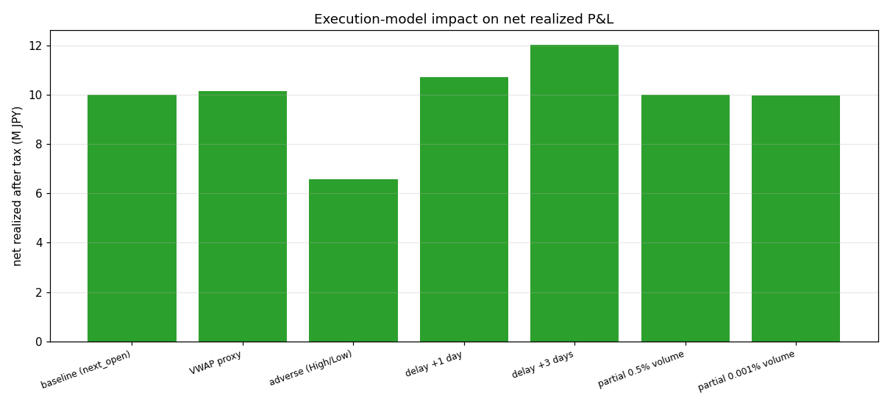

# 約定モデル現実化レポート（第4週 / D2）

> **目的**: 既定の「翌寄付 ± スリッページ」約定が楽観的すぎないかを検証する。レバ ETF の寄付は薄く、
> VWAP/TWAP は寄付と乖離し、不利な板で約定し、執行は遅延し、大口は出来高に対し部分約定する。
> **対象**: 1570.T 実データ 3,032営業日（2014-01-06〜2026-06-05・グリッチ補修済み）／ fast版（週次）。
> **手法**: baseline（既定）で捕捉したウォークフォワード・**パラメータ列を固定**し、`execution` 設定だけを
> 切り替えて同一戦略をリプレイ（再最適化しない＝執行効果のみを分離）。`simulate` 経由なのでルックアヘッド禁止・
> 損切り禁止の不変条件は不変。
> **生成物**: `outputs_execution/`（`execution.json`・`execution.csv`・`execution_impact.png`）。
> 再現: `python -m nikkei_leverage_sim.cli execmodel --config examples/config_fast.yaml --target data/target_1570_T.csv --benchmark data/benchmark_N225.csv --out outputs_execution`
>
> **コア結論**:
> 1. **最大の執行リスクは「不利約定」**。当日高値で買い・安値で売る最悪ケースでは実現益が **¥9.99M → ¥6.57M（−34%）** に減る。
>    既定の寄付約定はこの中間にあり、**寄付を取れる前提自体が最も効く楽観**。
> 2. **VWAP は寄付とほぼ同等**（+1.6%）。**部分約定は本戦略の規模では実質無影響**（0.5%出来高参加で±0%、
>    極端な0.001%でようやく−0.1%）＝1570.T の流動性に対し建玉が極小で、流動性は制約にならない。
> 3. **約定遅延はこの歴史では+7〜+20%と「得」に見えるが、これは優位ではなくノイズ**。Week3 で示したとおり
>    本戦略にタイミング・エッジは無い（置換検定 p=0.741）ので、遅延がたまたまプラスに出ただけ。**遅延を機能と
>    みなしてはならない**（別の歴史では逆に出うる）。

---

## 1. 約定シナリオ比較（同一戦略・執行のみ変更）

| シナリオ | 実現益(税後) | 期末資産 | 最大DD | 最大含み損 | 平均建玉 | 買い回数 | 最低維持率 | vs baseline |
|---|--:|--:|--:|--:|--:|--:|--:|--:|
| **baseline（翌寄付）** | ¥9.99M | ¥109.99M | ¥5.26M | ¥5.28M | ¥2.99M | 1048 | 9.76 | — |
| VWAP プロキシ | ¥10.15M | ¥110.15M | ¥5.54M | ¥5.49M | ¥3.05M | 1054 | 9.76 | +1.6% |
| **不利約定（高値買/安値売）** | **¥6.57M** | ¥106.57M | ¥6.06M | ¥6.01M | ¥3.84M | 956 | 9.33 | **−34.2%** |
| 遅延 +1日 | ¥10.71M | ¥110.71M | ¥5.01M | ¥4.92M | ¥3.29M | 1012 | 9.58 | +7.2% |
| 遅延 +3日 | ¥12.02M | ¥112.04M | ¥4.47M | ¥4.39M | ¥3.62M | 966 | 9.31 | +20.3% |
| 部分約定 0.5%出来高 | ¥9.99M | ¥109.99M | ¥5.26M | ¥5.28M | ¥2.99M | 1048 | 9.76 | ±0.0% |
| 部分約定 0.001%出来高 | ¥9.97M | ¥109.97M | ¥5.22M | ¥5.24M | ¥2.98M | 1052 | 9.76 | −0.1% |

---

## 2. 読み方

- **不利約定（−34%）が支配的リスク**。「当日高値で買い・安値で売る」は最悪側の上限だが、現実の薄い寄付・
  急変時の滑りはこの方向に振れる。**既定の寄付約定はベスト寄りの仮定**であり、実運用ではこの中間〜不利側を見込むべき。
- **VWAP ≈ 寄付（+1.6%）**。日中平均で約定できるなら寄付と大差なし（むしろ僅かに有利な日が多い）。
- **部分約定は本戦略では効かない**。1570.T の日次出来高（〜数百万株）に対し、本戦略の1日の建玉は数十株規模。
  現実的な 0.5% 参加では一切バインドせず、**0.001% という非現実的水準でようやく −0.1%**。
  → **流動性が制約になるのは、口座を現状の数百〜数千倍に拡大した場合のみ**（本検証の規模では非問題）。
- **遅延が「得」に見える件（+7〜+20%）は罠**。Week3 の置換検定（p=0.741）が示すとおり本戦略にタイミング・
  スキルは無い。遅延でリターンが動くのは順序ノイズの再配分にすぎず、**この歴史でたまたまプラス**に出ただけ。
  優位と解釈してレイテンシを歓迎するのは誤り。

---

## 3. 手法・前提・限界（正直な但し書き）

- **既定（next_open・全約定・遅延0）は従来挙動を保持**（リファクタ前から存在する不変条件テスト群が
  すべて不変で通過することで担保。`fill_model` 妥当値は `next_open`/`vwap`/`adverse`、未知値・負の遅延は `ValueError`）。
- **ルックアヘッド**：意思決定は `close_t`、約定は `open_{t+1+delay}`。VWAP/不利約定は**約定日のOHLC**を使うが、
  これは「執行が当日中に行われる」現実のモデル化であり、**意思決定が未来を見ているわけではない**
  （決定は前日終値で確定済み）。next_open のみ寄付だけを使うため、実行日終値を改変しても約定不変
  （`test_backtest_no_lookahead` で担保）。
- **部分約定は買い側のみ**（出来高参加で建玉株数を上限）。売りはロット単位（部分ロット売却は未対応）＝
  デモとしては積み増し側の制約を表現。売り側の部分約定は将来拡張。
- **遅延は強制決済にも適用するが、発火時にブローカーが主導権を取るモデル**：追証発火で**保留中の注文を全キャンセル**し、
  以後の遅延窓では**新規買いを発生させない**（無限後ろ倒し・債務超過中の建玉増加を防ぐ）。強制売却は**執行時点の全建玉**を
  決済（決定時スナップショットではない）。遅延は損失を深める方向にのみ働く＝保守的。
- 単一の歴史。Week2（別シナリオ）・Week3（有意性）と併読のこと。

## 4. テスト・再現

- `tests/test_execution.py`（13件）：fillモデル3種の価格式・不利約定が baseline を上回らない・出来高参加が建玉を縮小・
  遅延が結果を変える・**負の遅延で例外**・**遅延付き強制決済が無限後ろ倒しせず全建玉を決済**・既定がベースライン一致・
  未知モデルで例外・**比較設定の正規化（汚れた base でも baseline はクリーン）**・比較モジュールの整合と出力。全 **107件パス**。
- 全数値は `outputs_execution/execution.json`（`meta.data_repairs` にグリッチ補修を記録）。seed=42 で決定論的。
