# 1570.T レバレッジ・ロング積み増し戦略 バックテスト結果レポート（3バージョン比較版）

> **対象データ**: 1570.T（NEXT FUNDS 日経平均レバレッジ・インデックス連動型上場投信、日経2倍レバETF）実データ
> **ベンチマーク**: 日経225（N225）
> **期間**: 2014-01-06 〜 2026-06-05（**3,032営業日 ≒ 12年5ヶ月**）
> **比較したバージョン**: **fast版**（`config_fast.yaml`・週次／apply_days=5）／ **フル版**（`sample_config.yaml`・毎日／apply_days=1）／ **Codex版**（`config_codex.yaml`・月次／apply_days=21＋DDペナルティ強化）
> **生成物**: `outputs_real_fast/`・`outputs_real/`・`outputs_real_codex/`（各 summary.json / daily.csv / trades.csv / optimization.csv / report.md / benchmarks.json / PNG 6枚）

> 🔄 **v2 再生成ノート（2026-06）**: 本レポートは **v2 のデータ補修後**に 3 版すべてを再生成した数値です。**2021-04-27/28 のベンダー偽半値（実値 ~¥16,250 を ~¥8,040 と約半値で印字）をエンジンが自動補修**したことで、補修前（旧版）から **実現益が下方修正**されました（幻の急落が誤発火させていた利確が消えたため）：
> - **fast ¥10.48M → ¥9.99M（−4.7%）／ フル ¥11.39M → ¥10.74M（−5.7%）／ Codex ¥9.35M → ¥8.46M（−9.5%）**。
>
> 一方 **最大含み損・最大ドローダウンは旧と1円単位で不変**（コロナ底 2020-03-19 由来で、2021-04 のグリッチとは無関係）。なお委託保証金維持率の式も v2 で訂正したが、**¥100M 前提の本ランには影響しない**（建玉が薄く維持率が常に余裕＝追証ロジック不発火。式訂正の影響は薄資金ストレスの [REPORT_MARGIN_CALL.md] 側）。
>
> ⚠️ **結論の変化が1点**: 旧版は「リスク調整後（Sharpe）では fast が明確に最良」としていたが、**偽の −50% 日がフル版の Sharpe を特に強く押し下げていた**ため、補修後は **fast 0.447 ≒ フル 0.444 とほぼ同水準**になった（§3）。fast を推す根拠は **Sharpe ではなく「含み損・DD の浅さ・利確頻度」** に移る。総額最大＝フル版・不採用＝Codex版、という三者の推奨順位は不変。

---

## 0. ⚠️ 最初に読むべき但し書き

本戦略は **「損切り禁止 ＋ 利確のみ」** の積み増し戦略です。この構造上、**エクイティ曲線は綺麗な右肩上がりに見えやすい**一方で、**含み損の在庫が裏で滞留**します。実際、本バックテストでも（fast版の例）：

- **全営業日の 75.9%（2,300 / 3,032 日）で含み損を抱えていた**
- **最長で 534 営業日（約 2.1 年）連続で含み損状態**だった（2015-08-14 〜 2017-10-18）
- 決済ロット勝率 **100%**・profit factor **null（損失決済ゼロ）** という「綺麗すぎる」数字

これらは戦略が優秀である証拠ではなく、**「下がったら売らずに待つ」ことで実現損失を回避しているだけ**です。**この性質は 3 バージョンすべてに共通**します（§2 の通り、含み損の最長連続はどの版も約 534〜536 日、含み損日割合は 71〜76%）。バックテスト期間にたまたま致命的な暴落（指数が回復しない長期下落）が含まれていなければ、この戦略は美しく見えます。**評価軸は「実現益」ではなく「最大含み損ピーク・最悪日資産・資金拘束日数・含み損継続日数」に置くべき**です。

> **原則: 綺麗な右肩上がりの曲線が出たら、まず疑う。** 損切り禁止戦略では特に。そして **「総額が最大の版」＝「最良の版」ではない**（§3）。

---

## 1. エグゼクティブサマリ（3バージョン）

3 つのパラメータ適用頻度（`apply_days`）で同一戦略・同一データを回した結果です。

| 主要指標 | fast版（週次 / apply=5） | フル版（毎日 / apply=1） | Codex版（月次 / apply=21） |
|---|---:|---:|---:|
| 実現益（税引後） | ¥9.99M | **¥10.74M** ← 最大 | ¥8.46M |
| 年率リターン | 0.79% | **0.85%** ← 最大 | 0.68% |
| **最大含み損ピーク** | **¥5.28M** ← 最浅 | ¥6.35M | ¥6.16M |
| **最大ドローダウン** | **¥5.26M** ← 最浅 | ¥6.32M | ¥6.12M |
| **利確発生日数** | **454日** ← 最多 | 440日 | 407日 |
| **Sharpe-like** | **0.447** ← 最良（僅差） | 0.444 | 0.373 |
| 追証警告 / 追証 | 0 / 0 | 0 / 0 | 0 / 0 |

### 結論（先に）

- **「気持ちよく利確」する目的なら fast版（週次・apply_days=5）が最良**。利確発生日数が最多（454日）・利確なし最長空白が最短（65日）・含み損が最浅（¥5.28M）・最大DDが最浅（¥5.26M）。**“気持ちよさ”を構成する軸で勝っている**。
- **総額だけを最大化したいならフル版（毎日・apply_days=1）**。税引後 ¥10.74M で最大だが、その +¥0.75M は **より深い含み損（¥6.35M、fast比 +20%）と深いDD（¥6.32M）を代償**にしている（§3）。
- **Codex版（月次・apply_days=21 ＋ DDペナルティ倍化）は不採用**。狙った「DD・含み損の抑制」がむしろ悪化し、実現益・年率・Sharpe すべて3版中最下位（§4）。

> **一言**: 12.4 年で資産は税引後 +8.5〜10.7%（年率 0.68〜0.85%）。3 版とも **追証ゼロ・最大DD 5〜6%** とドローダウンは小さいが、それは **損切りを一切せず、最長 2.1 年も含み損を抱え続けた結果**。リターンの低さと資金拘束は表裏一体で、これも 3 版共通。

---

## 2. 3バージョン比較

### 2-1. サマリ指標（summary.json ベース）

| 指標 | fast版 | Codex版 | フル版 | 評価 |
|---|---:|---:|---:|---|
| 実現益（税後） | ¥9.99M | ¥8.46M | **¥10.74M** | フル版が総額最大 |
| 年率 | 0.79% | 0.68% | **0.85%** | 同上 |
| 最大含み損 | **¥5.28M** | ¥6.16M | ¥6.35M | fast版が最浅 |
| 最大DD | **¥5.26M** | ¥6.12M | ¥6.32M | 同上 |
| 利確発生日数 | **454** | 407 | 440 | fast版が最多 |
| 利確日あたり益 | ¥22,000 | ¥20,797 | **¥24,405** | フル版が太い |
| 利確なし最長 | **65日** | 97日 | 100日 | fast版が短い |
| 最長保有 | **552日** | 685日 | 552日 | fast版/フル版同点 |
| Sharpe類似 | **0.447** | 0.373 | 0.444 | fast版が僅差で最良（≒フル版） |
| 露出上限ヒット | 25 | **19** | 30 | Codex版が低い |
| 総取引数 | 2,096 | 1,842 | 2,126 | Codex版が最少 |
| 信用金利支払 | ¥696K | ¥659K | ¥805K | フル版が高い |
| 税金支払 | ¥2.55M | ¥2.16M | ¥2.74M | フル版が高い |
| 平均利益/決済ロット | ¥9,531 | ¥9,191 | **¥10,102** | フル版が最大 |
| 最低維持率 | 9.76 | 9.84 | 9.68 | 全版とも 30%閾値の約32倍（不感） |

### 2-2. 日次データから導いたリスク軸（daily.csv ベース）

損切り禁止戦略の本質的リスクは P&L ではなく **「どれだけ深く・長く含み損を抱えたか」** にあります（§0）。3 版を同一基準で再集計：

| リスク指標 | fast版 | Codex版 | フル版 | 評価 |
|---|---:|---:|---:|---|
| 最悪日資産（最安equity） | **¥97.93M** | ¥97.43M | ¥97.33M | fast版が最も浅い |
| 最大含み損ピーク | **−¥5.28M** | −¥6.16M | −¥6.35M | fast版が最も浅い |
| 含み損を抱えた日の割合 | 75.9% | **71.2%** | 75.7% | Codex版が最少（※後述） |
| 含み損 最長連続日数 | 534日 | 534日 | 536日 | ほぼ同一（≒2.1年） |
| 最悪日（最大含み損の底） | 2020-03-19 | 2020-03-19 | 2020-03-19 | 全版コロナ底で最大化 |
| 時価建玉が¥10M超の日数 | 70日 | 55日 | 40日 | フル版が最少 |

- **最悪日資産・最大含み損は fast版が最も浅い**（¥97.93M / −¥5.28M）。総額最大のフル版が最も深い（¥97.33M / −¥6.35M）＝ **稼ぎと含み損の深さは比例**している。
- **含み損日割合は Codex版が最少（71.2%）** だが、これは「リスクが低い」のではなく **取引機会を絞った（総取引 1,842・利確 407日）結果、ポジションを持っていない日が多い**だけ。実際に持った時の含み損は fast版より深い（−¥6.16M）。「保守化したのに損は深い」という最悪の組み合わせ（§4）。
- **含み損の最長連続は 3 版とも 534〜536 日（約 2.1 年）でほぼ不変**。これは戦略構造（損切り禁止）由来であり、`apply_days` をいじっても消えない＝ **§0 の構造的リスクはパラメータ調整では解決しない**。

---

## 3. apply_days による過剰最適化の分析

3 バージョンの本質的な違いは **ウォークフォワード最適化で求めたパラメータを「どれだけの頻度で入れ替えるか」（`apply_days`）** です。

| 版 | `apply_days` | `rebalance_frequency` | 意味 |
|---|---:|---|---|
| フル版 | 1 | daily | **毎日**パラメータをリコンパイル |
| fast版 | 5 | weekly | **週次**で入れ替え |
| Codex版 | 21 | daily | **月次**まで間引く（＋DDペナルティ倍化） |

### 観察された傾向

| 軸 | フル版（毎日） | fast版（週次） | Codex版（月次） |
|---|---:|---:|---:|
| 実現益（総額） | **最大 ¥10.74M** | ¥9.99M | 最小 ¥8.46M |
| 最大含み損（深さ） | 最深 ¥6.35M | **最浅 ¥5.28M** | ¥6.16M |
| 利確発生日数 | 440 | **最多 454** | 最少 407 |
| Sharpe（リスク調整後） | 0.444 | **僅差で最良 0.447** | 最低 0.373 |

1. **「毎日リコンパイル」（フル版）は総額を稼ぐが、含み損も増やす**。直近 252 日のノイズに毎日フィットし、より積極的に建てて利確日あたり益（¥24,405）を太らせる一方、含み損ピークは最深（¥6.35M）・最大DDも最深（¥6.32M）。「総額が最大」＝「より大きな含み損リスクを引き受けた」であり、見かけの良さは割り引いて見るべき。

2. **「月次に間引く」（Codex版）は両方悪化**。過剰最適化を抑えるつもりが、**取引機会まで逸失**して総額が最小（¥8.46M）・利確日数が最少（407日）・利確なし最長空白が最長（97日）に。しかも保守化したのに含み損は fast より深い（¥6.16M）。**「保守化の裏目」**。

3. **「週次」（fast版）がスイートスポット**。総額はフル版に譲る（−¥0.75M）が、**含み損・最大DDが最浅・利確が最頻**。ノイズへの過剰フィットを抑えつつ取引機会は確保できる、という中庸が効いた。

### リスク調整後（Sharpe）で並べると — ⚠️ v2 で評価が変わった点

> **Sharpe-like: fast版 0.447 ≳ フル版 0.444 ＞ Codex版 0.373**

- **旧版（補修前）では fast 0.376 ＞ フル 0.351 と差が明確**で、「総額はフルが首位だが、リスク調整後では fast が明確に最良＝総額の罠」と結論していた。
- **しかしこれは偽の −50%/+100% 往復（2021-04）が、より積極的に建てるフル版の Sharpe を特に強く押し下げていた産物**だった。データ補修でフル版の Sharpe が 0.351→**0.444** へ正常化した結果、**fast（0.447）とフル（0.444）は実質的に同水準**になった。
- したがって **「Sharpe で fast がフルに明確に勝つ」という旧主張は成立しない**。**fast を推す根拠は Sharpe ではなく、「最大含み損・最大DD の浅さ（フル比 −17%）と利確頻度の高さ・利確空白の短さ」** にある。「リスク1単位あたり」ではほぼ互角だが、**“被る痛みの絶対量（含み損・DDの深さ）”と“気持ちよさ（利確頻度）”で fast が優る**、という整理が v2 後の正確な姿。
- Codex版（0.373）が Sharpe でも最下位である点は不変。

---

## 4. Codex指摘の効果検証

事前レビューで Codex は次を助言していました：

> **Codex の助言**: 「`rebalance_frequency: daily` ＋ `apply_days: 1`（毎日リコンパイル）は過剰最適化リスクが高い。`apply_days` を伸ばし、最適化目的関数の DD/含み損ペナルティ（`weight_max_drawdown_equity` / `weight_max_unrealized_loss`）を強化せよ。」

これを忠実に実装したのが **Codex版**（`apply_days=21` ＋ `weight_max_drawdown_equity` と `weight_max_unrealized_loss` を 0.5 → **1.0 に倍化**）。実データでの結果：

| 狙い | 期待 | 実データの結果 | 判定 |
|---|---|---|---|
| 過剰最適化の抑制 | 安定した取引 | 取引機会を逸失（総取引 フル 2,126→Codex 1,842、利確 fast 454→Codex 407日、空白 65→97日） | ❌ 逆効果 |
| DD の抑制（ペナルティ倍化） | DD が浅くなる | **最大DD が悪化**（fast ¥5.26M → Codex ¥6.12M） | ❌ 逆効果 |
| 含み損の抑制 | 含み損が浅くなる | **最大含み損が悪化**（fast ¥5.28M → Codex ¥6.16M） | ❌ 逆効果 |
| 総合 | 改善 | 実現益・年率・Sharpe すべて 3 版中最下位 | ❌ 全面劣後 |

### なぜ裏目に出たか

- **過剰最適化抑制 ↔ 取引機会逸失のトレードオフが裏目**。`apply_days=21` でパラメータを月次までしか更新しないと、相場の変化に追従できず **「利確すべき場面で建玉が無い／閾値が古い」**状態が増え、利確発生日数が最少（407日）に落ちた。「気持ちよく利確」とは正反対の方向。
- **DDペナルティの強化が、かえって含み損を積み上げた**。最適化目的で DD/含み損を強く嫌うと、最適化器は **「利確閾値を上げて／建てを絞って当面の損失計上を避ける」**方向のパラメータを選びがち。結果、**目先の DD を避けようとして却ってポジションを長く塩漬けし、含み損ピークは深くなった**（ペナルティを倍にしたのに DD・含み損とも悪化）。最適化の目的関数を保守側に振ることが、損切り禁止戦略では逆効果になりうる、という反例。

### 公平のための注記

Codex版が他版に勝った数少ない指標：**露出上限ヒットが最少（19回）／含み損を持つ日割合が最少（71.2%）**。ただしこれらはいずれも **「取引を絞った副作用」**であって、総額・年率・Sharpe・利確頻度・含み損の深さという主要評価軸を覆すものではない（v2 補修後は平均利益/決済ロットでも Codex版が最下位 ¥9,191 となり、旧版で挙げた「ロット単価が僅差で最大」という擁護点も消えた）。

> **結論: Codex の助言は理論的には妥当だが、この戦略・このデータでは保守化が裏目に出て全面的に劣後した。採用しない。** ただし Codex のもう 1 つの指摘（コスト前提が楽観的＝感応度分析が必要、§11）は依然として有効（→ [REPORT_STRESS.md] で実施済み）。

---

## 5. fast版の設定詳細（推奨版）

> 以下 §5〜§11 は **推奨版（fast版）の詳細評価**です。フル版・Codex版の対応数値は §2 の比較表を参照してください。

本結果は `examples/config_fast.yaml`（fast版）によるものです。通常版 `examples/sample_config.yaml`（＝フル版）との差分は最適化（ウォークフォワード）のリバランス頻度のみ：

| 項目 | フル版（sample_config） | **fast版（config_fast）** | Codex版（config_codex） |
|---|---:|---:|---:|
| `optimization.n_trials` | 100 | **40** | 100 |
| `optimization.lookback_days` | 252 | 252 | 252 |
| `optimization.apply_days` | 1 | **5** | 21 |
| `optimization.rebalance_frequency` | daily | **weekly** | daily |
| `objective.weight_max_drawdown_equity` | 0.5 | 0.5 | **1.0** |
| `objective.weight_max_unrealized_loss` | 0.5 | 0.5 | **1.0** |
| その他（戦略パラメータ・コスト等） | 同一 | 同一 | 同一 |

fast版では **週次リバランス（apply_days=5）** とすることで、直近 252 日のノイズに過剰にフィットしてパラメータを毎日入れ替える挙動を抑制しています。すなわち本レポートの数字は **「過剰最適化の影響を相対的に抑えた設定」での結果**です。

---

## 6. 実現益の評価（目標 ¥5,000 との比較・fast版）

| 切り口 | 実現益（税引後） | 目標 ¥5,000 |
|---|---:|:--:|
| **1 営業日あたり**平均 | ¥3,294 | ❌ 未達 |
| 1 暦日あたり平均 | ¥2,203 | ❌ 未達 |
| **1 利確発生日あたり**平均 | ¥22,000 | ✅ 達成 |
| 1 利確発生日あたり中央値 | ¥9,061 | ✅ 達成 |
| 1 決済ロットあたり平均 | ¥9,531 | ✅ 達成 |

- **「利確が出た日」だけを見れば** 1 日あたり平均 ¥22,000・中央値 ¥9,061 で目標 ¥5,000 を上回る（`fixed_profit_yen: 5000` の固定利確が効いている）。
- ただし利確は **全営業日の 15.0%（454日）でしか発生しない**ため、**全営業日でならすと 1 日 ¥3,294** にとどまり、ベタ塗りの「毎日 ¥5,000」目標には届かない。
- 平均利益/決済ロット ¥9,531 は `fixed_profit_yen 5,000` ＋ 変動利確分の合算。

---

## 7. 建玉・含み損・追証イベント（fast版）

### 最大建玉（cost basis ¥10M 厳守 / mark-to-market 超過は仕様 OK）

- **最大建玉（mark-to-market）**: **¥10,773,060**（2025-05-12）
- 平均建玉: ¥2,991,048（初期資金の約 3%）
- **mark-to-market で ¥10M を超えた日: 70 日**

設定上の `max_gross_exposure: 10,000,000` は **取得原価（cost basis）ベースの上限**であり、**新規建てはこの ¥10M を厳守**しています。**評価額（時価 / mark-to-market）が ¥10M を超過するのは、既存建玉の含み益による値上がり分**であり、**仕様として許容**されます。最大の超過は 2025-05-12 の ¥10.77M（cost basis 上限に対し +7.7%）で、これは保有玉の値上がりによるものです。

### 建玉上限・追証イベント

| イベント | 回数 |
|---|---:|
| 建玉上限（cost basis ¥10M）到達 | 25 |
| 追証警告（margin_warning） | **0** |
| 追証（margin_call） | **0** |

- **追証は一度も発生していません**（`force_liquidation: false`・維持率 30% 設定下、最低維持率 9.76）。平均建玉が初期資金の約 3%、最大でも 10% と**極めて低レバレッジ運用**のため、維持率に余裕がある。

---

## 8. 【主役】リスク中心の評価 — 実現益ではなく「含み損・資金拘束」で見る（fast版）

損切り禁止戦略の本質的リスクは P&L ではなく **「どれだけ深く・長く含み損を抱え、資金を拘束したか」** にあります。

| リスク指標 | 値 | コメント |
|---|---:|---|
| **最大含み損ピーク** | **¥5,281,311**（2020-03-19） | 初期資金の 5.3%。コロナ底で最大化 |
| **最悪日資産** | **¥97,925,845**（2020-03-19） | 初期割れ。最悪でも −2.1% に収まった |
| **資金拘束日数（最長ロット保有）** | **552 日** | 1 つの建玉を約 1.5 年塩漬け |
| **含み損 最長連続日数** | **534 営業日（≒2.1年）** | 2015-08〜2017-10。2 年超ずっと含み損 |
| **含み損を抱えた日の割合** | **75.9%（2,300 / 3,032 日）** | 大半の日は含み損在庫を抱えていた |

### 解釈

- equity の最大下落は −¥5.26M（−5.1%）と小さく見えるが、それは**含み損を実現損に変えずに「待った」から**。
- **2.1 年（534 営業日）連続で含み損**を抱えた局面があり、その間は**資金が拘束され、機会損失と精神的負荷が発生**する。実運用ではこの期間に耐えられず手仕舞いしてしまうと、バックテストの「綺麗な数字」は再現しない。
- 75.9% の日で含み損 ＝ **「含み損を抱えているのが常態」**。利確の瞬間だけ切り取ると勝率 100% に見えるが、実態は長期の含み損ポジションの上に成り立っている。
- **§2-2 の通り、この性質は 3 版すべてに共通**（含み損最長連続 534〜536日）。`apply_days` の調整では構造的リスクは消えない。

---

## 9. 大暴落時の挙動（過去 12.4 年に含まれる主要ショック・fast版）

本バックテスト期間には複数の大暴落が含まれます。各局面での戦略の耐性：

| 局面 | 底の日付 | 最悪日資産 | 最大含み損 | N225（局面始値→底） |
|---|---|---:|---:|---|
| **コロナショック（2020）** | 2020-03-19 | ¥97,925,845 | −¥5,281,311 | 22,972 → 16,553 |
| **2025年4月急落** | 2025-04-07 | ¥104,063,416 | −¥4,293,085 | 39,631 → 31,137 |
| **2016 中盤（Brexit 前後）長期DD** | 2016-06-24 | ¥98,804,210 | −¥1,592,398 | 20,548 → 14,952 |

- いずれの暴落でも **追証は発生せず**、その後の指数回復に伴って含み損が解消し利確に至っている。
- ただしこれは **「対象指数がいずれも回復した」という後知恵**に支えられている。コロナ底（−¥5.28M）・2025年4月（−¥4.29M）はいずれも 2倍レバETF が短期間で半値近くまで急落した局面であり、**もし回復しなければ含み損は実現損として確定し、追証・強制ロスカットのリスクがあった**。
- **「致命的だが回復しない暴落」がこの期間に無かった**点は、結果を割り引いて見る必要がある（§0 の警戒原則）。薄資金（¥5M/¥3.3M）での追証感応度は [REPORT_STRESS.md]・[REPORT_MARGIN_CALL.md] を参照。

---

## 10. 同期間「ただ買って持つ」基準との比較 — 一括 buy & hold ／ 定額積立(DCA)（fast版）

「本戦略の小細工（レバ＋条件付き積み増し＋利確）は、**淡々と買って持つだけ**に対して何を買っているのか」を問うため、
同一期間の対象を **2 通り**で並べる。

- **一括 buy & hold**: 初日に全額を投じて放置（最も積極的な資金投入＝上限の参照点）。
- **定額積立 (DCA)**: **本戦略と同じ建玉上限 ¥10M を市場投下の上限に設定**し、同一の ¥100M 口座で
  毎営業日に均等額を買い続けて持つだけ（レバなし・利確なし、残りは現金）。**口座サイズもリスク枠も本戦略と完全に同じ**にした、最も公平な双子。

### 10-1. ★フェア比較：同一¥100M口座・同一¥10Mリスク枠（自動生成 §4 と同値）

本戦略と DCA を **まったく同じ条件**（¥100M 口座・市場投下上限 ¥10M・残りは現金）に揃えた正面比較：

| 戦略 | 期末資産 | 総リターン | CAGR | 最大DD額 | 最大DD% | Sharpe | Sortino | Ulcer | CVaR95 |
|---|---:|---:|---:|---:|---:|---:|---:|---:|---:|
| **本戦略**（fast・平均建玉¥3M） | ¥109.99M | +10.0% | 0.83% | ¥5.26M | 5.0% | 0.447 | — | — | — |
| **1570.T 定額積立(¥10M枠)** | ¥160.66M | **+60.7%** | 4.02% | ¥15.18M | 12.4% | 0.653 | 0.671 | 2.35 | 0.91% |
| **N225 定額積立(¥10M枠)** | ¥118.11M | **+18.1%** | 1.39% | ¥4.40M | **4.1%** | 0.669 | 0.683 | 0.71 | 0.30% |

- **同じ ¥10M しか張らなくても、ただ積み立てて持つだけが本戦略に勝つ。** 1570.T DCA は **+60.7%** と本戦略(+10%)の6倍。
  ただし最大DDも ¥15.18M（12.4%）と本戦略の ¥5.26M（5.0%）の約3倍 ＝ **「6倍のリターンを3倍のDDで買う」明確なトレードオフ**。
  DD が ¥10M 枠を超えるのは、投下は ¥10M 打ち止めでも含み益で評価額が ¥70M 超まで膨らみ、後半の下落がその大きな建玉に効くため。
- **N225 の定額積立は本戦略にリターンでもDDでも勝つ**（+18.1% vs +10%、最大DD ¥4.40M vs ¥5.26M、CVaR 0.30% vs —）。
  **無レバの素の指数を同じ枠で淡々と積むだけで、レバ＋最適化の本戦略を全項目で上回る**という、最も厳しい結果。レバETF特有の逓減を避けられる分、リスク当たりでむしろ優位。
- 本戦略が勝っているのは「最大DD額が 1570.T 版より小さい」点のみ。これは利確で建玉を絞り戻すため。

### 10-2. 参考：上限を外して「全力で買う」と何が起きたか

リスク枠の制約を外し、**¥100M を全額**市場に晒した場合の上限値（同 §4 とは別前提の参考）：

| 戦略（¥100M 全額投下） | 期末資産 | 総リターン | 最大DD% |
|---|---:|---:|---:|
| 1570.T 一括 B&H | ¥1,291.91M | **+1,191.9%** | 55.4% |
| 1570.T 定額積立（全額） | ¥706.61M | +606.6% | 46.9% |
| N225 一括 B&H | ¥418.89M | +318.9% | 31.8% |
| N225 定額積立（全額） | ¥281.13M | +181.1% | 24.6% |

- 1570.T 終値 **5,625 → 72,670 ＝ ×12.92**（N225 は 15,909→66,641 ＝ ×4.19）。強い上昇トレンドで2倍レバの逓減を複利が上回った稀有な期間。
- 全額張れば一括 B&H は +1,191.9% に達するが、**最大DD 55%**（コロナで評価額が半値近く）を伴う。定額積立(全額)はそれを +606.6%／DD 46.9% に和らげる ＝ DCA の教科書どおりの「上げを取り逃す代わりにDDが浅くなる」挙動。

### 10-3. まとめ — 本戦略の立ち位置

- **同じ ¥10M 枠で正面比較しても、本戦略はリターンで定額積立に大きく劣る**（1570.T 比 1/6、N225 にはDDでも負け）。「資金の3%しか張っていないから負けた」だけでなく、**同じ枠を与えても、利確で勝者を切り押し目買い（平均回帰）で大トレンドに逆らう設計そのものが、淡々と積み立てて持つだけに劣る**ことが確認できる。
- 本戦略が唯一明確に勝つのは **1570.T を同枠で積むより最大DD額が小さい**点（利確で建玉を絞り戻すため）。ただし無レバの N225 定額積立には DD でも負ける。
- 本戦略の存在意義は「リターン最大化」ではなく**資本保全型**にあるが、その保全効果すら**「素の指数を同枠で積み立てる」だけで上回られる**。価値が出るのは、**レバETF を使わざるを得ず・かつ深いDDを絶対に避けたい**という限定的な状況に絞られる。
- **重要**: この期間は2倍レバETFに歴史的な追い風だった。**逆風（長期下落・レンジ）局面では B&H・定額積立の優位は容易に逆転する**（とくにレバETFは逓減が効く）。本戦略の低リターンは「強気相場で取り逃した」とも「暴落で守られた」とも読め、評価は局面依存。

> 注: DCA 数値は追跡済みの実価格系列（`outputs_real/daily.csv` の `target_close`／`benchmark_close`、3,032営業日）から、エンジンと同一のメトリクス関数で算出（`benchmark.dca_curve(deploy_cap=¥10M)` と一致）。一括 B&H 値は `benchmarks.json` と1円単位で一致することを確認済み。各版の `report.md §4`・`benchmarks.json` にも上限¥10MのDCA2行が反映済み。

---

## 11. レバ ETF 特有コストの織り込み（但し書き）

本バックテストは以下を**織り込み済み**です（3 版とも同一コスト前提）：

- **レバレッジETF の逓減（ボラティリティ・ドラッグ）**: 1570.T の実 OHLCV を使用しているため、日次リバランス由来の逓減は価格データに内包。
- **信用金利**: 年率 2.8%（`annual_margin_interest_rate: 0.028`）。fast版で総額 ¥695,693 を支払い（フル版 ¥805K・Codex版 ¥659K）。
- **税**: 20.315%（`tax_rate`）。fast版で総額 ¥2,546,361 を支払い。
- **スリッページ**: 2 bps（`slippage_bps: 2.0`）。
- 手数料: 0 bps（`commission_bps: 0.0`）。

### コスト前提の楽観性（Codex 指摘 — 依然有効。感応度分析は実施済み）

> **Codex 指摘**: スリッページ 2bps / 金利 2.8% / 税 20.315% は**現実より楽観的な可能性**があり、感応度分析が必要。

- **スリッページ 2bps は楽観的**: 2倍レバETF の急落局面・場中の薄い板では、実約定はこれより不利になりやすい。
- **手数料 0**: ネット証券の現物・信用でも完全 0 は前提として強い。
- **金利 2.8%**: 信用金利は証券会社・時期により変動。利上げ局面では上振れ。
- → **slippage を 5〜20bps、金利を 1.5〜6.0% に振った感応度分析**は [REPORT_STRESS.md] で実施済み（薄利のコスト頑健性を確認）。執行の不利・遅延・部分約定の影響は [REPORT_EXECUTION.md] を参照。**この指摘は §4 の `apply_days`/DDペナルティ提案と違い、3 版すべてに有効**。

---

## 12. グラフ（3バージョン）

### 12-1. fast版（推奨 / 週次・apply_days=5）

| エクイティ曲線 | エクスポージャ |
|---|---|
| 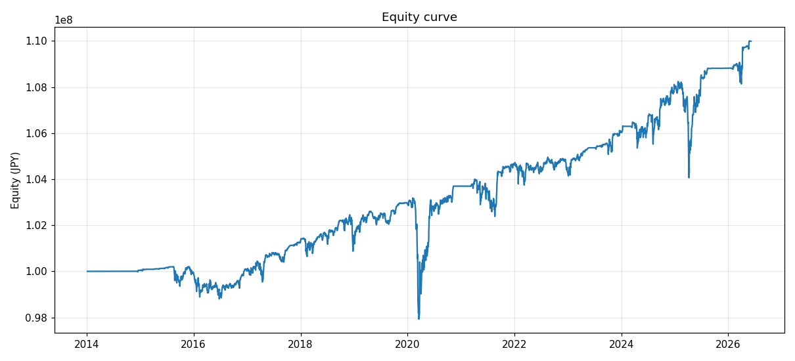 | 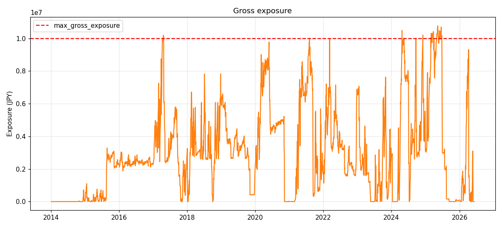 |

| ドローダウン | 実現益（日次・税引後） |
|---|---|
| 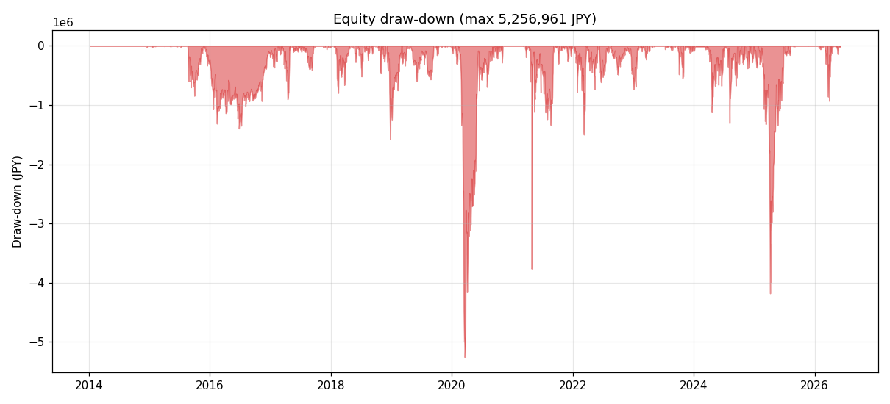 | 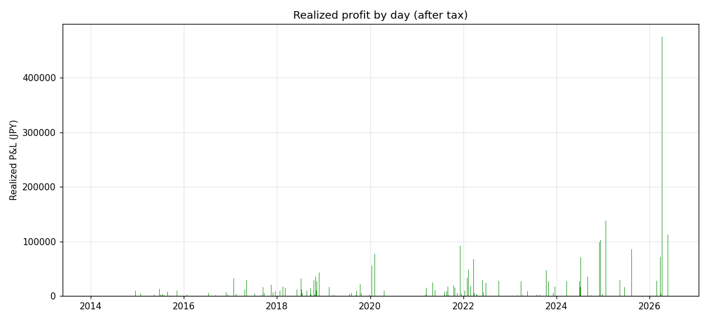 |

100M → 110.0M へ緩やかな右肩上がり。2016・**2020（コロナ、最深 ¥97.9M）**・2021・**2025年4月**に鋭い V 字下落。最大DD −¥5,256,961。全バーが正（損失決済ゼロ＝勝率 100%）＝「損切り禁止」の構造を物語る。§0 の通り、この「綺麗さ」自体を疑うこと。
（リスク中心の自動生成サマリは `outputs_real_fast/report.md`、対パッシブ比較は `benchmarks.json` を参照。）

### 12-2. フル版（総額最大 / 毎日・apply_days=1）

| エクイティ曲線 | エクスポージャ |
|---|---|
| 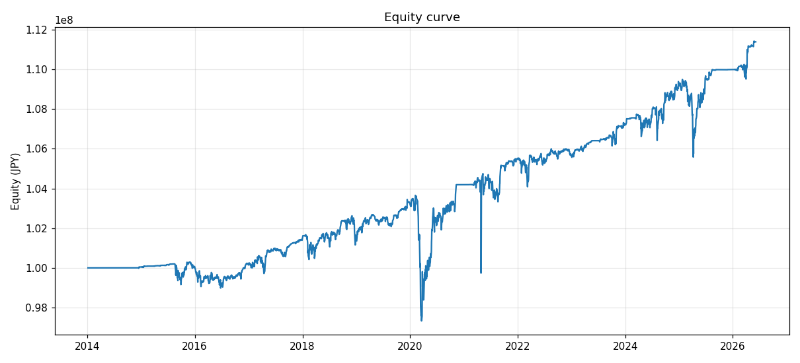 | 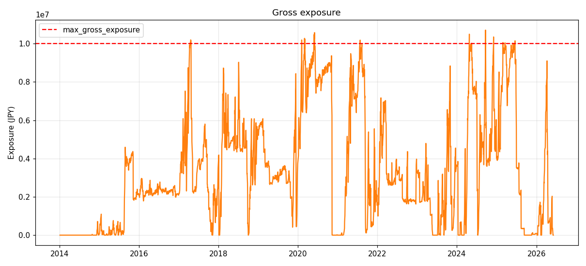 |

| ドローダウン | 実現益（日次・税引後） |
|---|---|
| 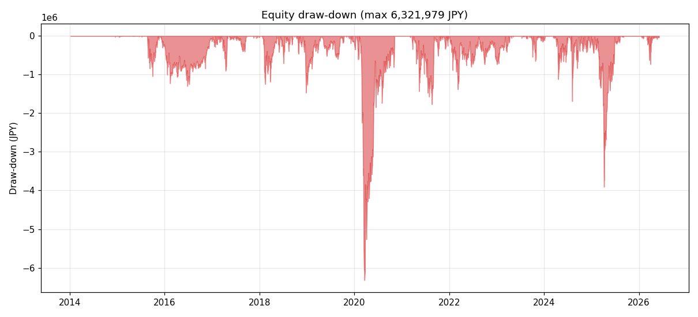 | 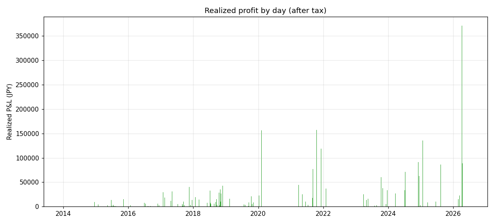 |

総額は最大（¥10.74M）だが、**ドローダウンは fast版より深い（最大 −¥6.32M）**。毎日リコンパイルが利確日あたり益（¥24,405）を太らせる一方、含み損ピークも最深（¥6.35M）に。Sharpe は fast とほぼ互角（0.444）だが、被る含み損・DD の絶対量で劣る（§3）。

### 12-3. Codex版（不採用 / 月次・apply_days=21 ＋ DDペナルティ倍化）

| エクイティ曲線 | エクスポージャ |
|---|---|
| 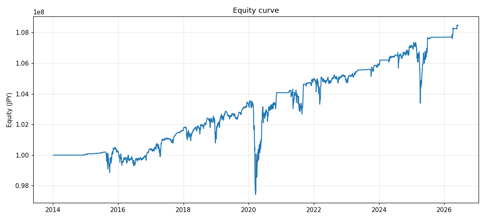 | 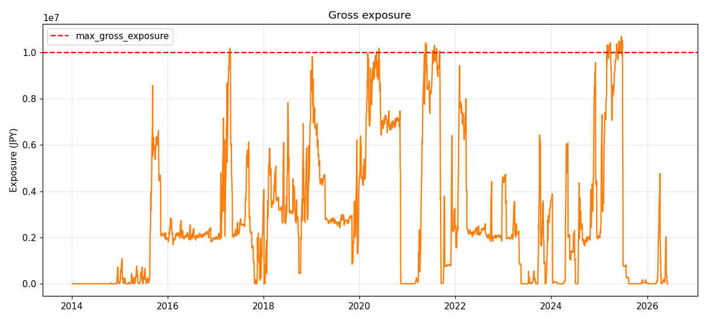 |

| ドローダウン | 実現益（日次・税引後） |
|---|---|
| 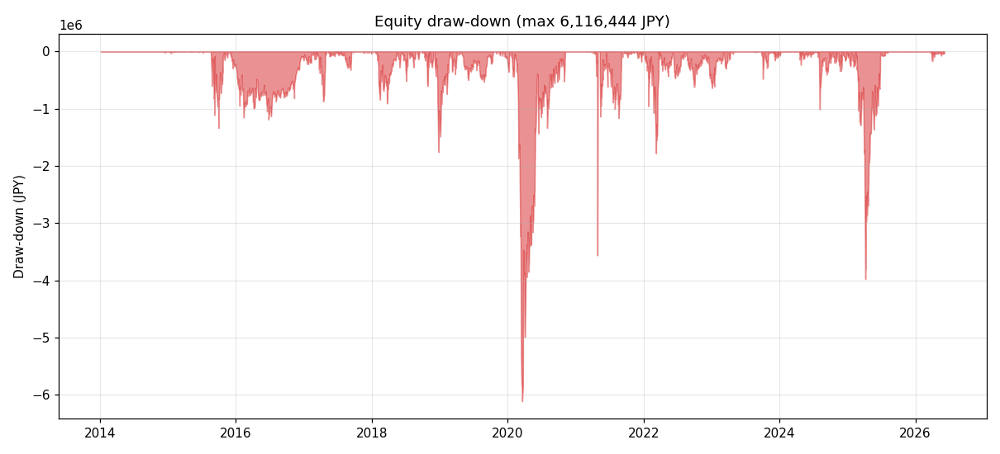 | 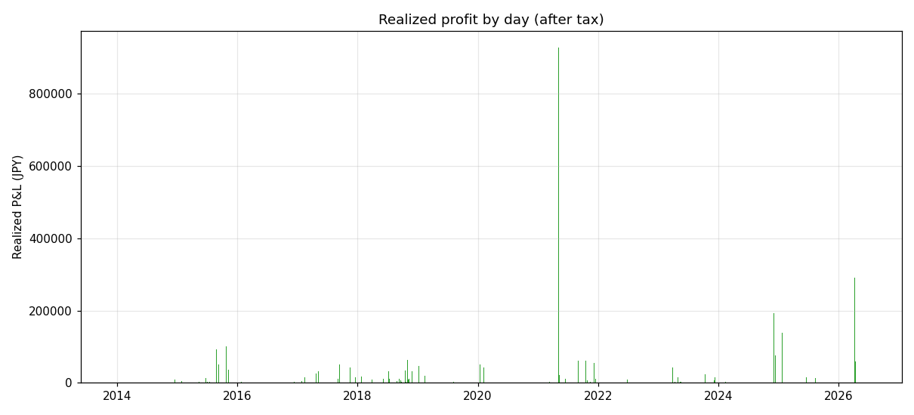 |

取引機会を絞った（利確 407日・空白最長 97日）結果、エクイティの傾きは最も緩く、総額最小（¥8.46M）。DDペナルティを倍にしたのに **DD はむしろ悪化（−¥6.12M）**。保守化が裏目に出た版（§4）。

---

## 13. 結論と但し書き

### 結論（どの版を採るか）

| 目的 | 推奨版 | 根拠 |
|---|---|---|
| **「気持ちよく利確」したい** | **fast版（週次）** ✅ | 利確発生日数 最多（454日）・利確なし空白 最短（65日）・含み損 最浅（¥5.28M）・最大DD 最浅（¥5.26M）。“気持ちよさ”と“被る痛みの小ささ”で勝ち |
| **総額を最大化したい** | フル版（毎日） | 税引後 ¥10.74M で最大。Sharpe は fast とほぼ互角だが、**含み損 +20%・DD +20% 深い**のが代償 |
| — | **Codex版（月次）は不採用** ❌ | 保守化が裏目。総額・年率・Sharpe・利確頻度すべて最下位、DD・含み損もむしろ悪化 |

- 3 版とも 12.4 年・3,032 営業日で **税引後 +8.5〜10.7M（年率 0.68〜0.85%）**、**追証ゼロ・最大DD 5〜6%** とリスクは小さく抑制。
- ただしそれは **損切りを一切せず、全営業日の 71〜76% で含み損を抱え、最長 2.1 年（534〜536日）含み損を継続**した結果であり、**リターンの低さ・資金拘束と引き換え**。これは `apply_days` 調整では消えない構造的性質。
- リターンのみなら **同期間の 1570.T buy & hold（+1,192%）に 3 版とも大敗**。本戦略は「資本保全・低レバ」型であり、強気相場での機会取り逃しと暴落耐性が表裏一体。

### 但し書き

1. **「総額が最大の版」＝「最良」ではない**。フル版（毎日リコンパイル）は総額最大だが含み損・DD が深い。**v2 補修後は Sharpe では fast とフルがほぼ互角**になったので、fast を推す根拠は「Sharpe」ではなく「含み損・DD の浅さ・利確頻度」に置く（§3）。
2. **Codex の `apply_days`/DDペナルティ提案は実データで裏目**（§4）。理論的には妥当だが、損切り禁止戦略では保守化が取引機会逸失と含み損積み上げを招いた。**一方、コスト前提が楽観的という Codex の別指摘（§11）は依然有効で、[REPORT_STRESS.md] で感応度分析済み**。
3. **コスト前提は楽観的な可能性**（slippage 2bps・金利 2.8%）。3 版共通で感応度分析が必須（§11）。
4. **損切り禁止戦略の構造的リスク**: 含み損在庫の滞留（§0・§8）。期間に「回復しない大暴落」が無かった幸運に支えられている。これも 3 版共通。
5. **バックテストは将来を保証しない**。レバ ETF 逓減・信用金利・税・スリッページは織り込み済みだが、未知の暴落・金利上昇・流動性枯渇は別問題。
6. **データ補修**: 2021-04-27/28 のベンダー偽半値を補正済み（既定 ON、監査証跡は各 `summary.json` の `data_quality` と `report.md`）。本レポートの全数値は補修後の再生成値。

---

*生成元: `outputs_real_fast/`（`config_fast.yaml`・週次）／ `outputs_real/`（`sample_config.yaml`・毎日）／ `outputs_real_codex/`（`config_codex.yaml`・月次＋DDペナルティ強化）。データ: `data/target_1570_T.csv`・`data/benchmark_N225.csv`（2014-01-06〜2026-06-05）。数値は v2 データ補修後の再生成値（2026-06）。*
