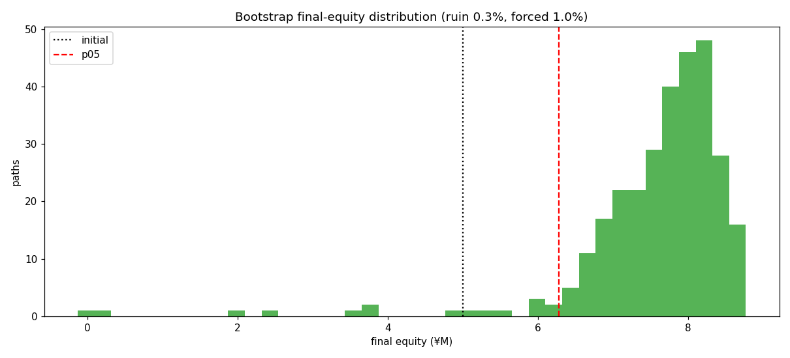

# ストレステスト・レポート（第2週 / D1）

> **目的**: 「損切り禁止＋利確のみ」レバ戦略の **テール耐性**（暴落時の含み損ピーク・最低維持率・追証発生・破綻確率）を直接測る。
> **対象**: `config_fast.yaml`（fast版・週次）／ 1570.T 実データ 3,032営業日（2014-01-06〜2026-06-05、**グリッチ補修済み**）。
> **生成物**: `outputs_stress/`（`stress.json`・`regimes.csv`・`regimes_thin.csv`・`sensitivity.csv`・`bootstrap_paths.csv`・チャート）。再現: `python -m nikkei_leverage_sim.cli stress --config examples/config_fast.yaml --target data/target_1570_T.csv --benchmark data/benchmark_N225.csv --out outputs_stress`
>
> **コア結論**:
> 1. **歴史的には全危機を生存**。¥100M 前提はもちろん、現実的な **¥5M（2倍レバ）でも 2014–2026 の全暴落で追証ゼロ**（最低維持率は 2020 コロナの **0.452**＝閾値 0.30 に最接近だが割らず）。
> 2. **ただし「歴史は1本の標本」**。ブロック・ブートストラップ（同じ統計を持つ 300 本の別シナリオ）では、¥5M で **追証発生 1.0%・破綻 0.3%**、最悪経路は期末 **−¥0.13M（債務超過）**。2倍レバは「概ね安全だが無視できないテール」を持つ。
> 3. コストには頑健。スリッページ 2→20bps・信用金利 1.5→6.0% のフルレンジでも実現益は **¥10.22M→¥9.26M**（▲9%程度）に収まる。

---

## 1. 歴史的レジーム別ストレス

各危機ウィンドウを、**完成済みバックテストの日次系列から切り出して**評価（その危機に入った時点の建玉をそのまま被る、現実的な計測）。
2008/2011 は 1570.T 上場前でデータ範囲外のため対象外（沈黙して 0 埋めせず明示）。

### 1a. 本番前提（自己資金 ¥100M）

| 危機 | 営業日 | N225 | 1570.T | 自己資産騰落 | 最大DD | 含み損ピーク | 最低維持率 | 追証 |
|---|--:|--:|--:|--:|--:|--:|--:|--:|
| 2015 中国ショック/円高 (Aug) | 40 | −15.4% | −29.7% | −0.73% | 0.85% | ¥0.91M | 30.41 | 0 |
| 2016 円急騰/Brexit (H1) | 122 | −15.6% | −31.8% | −0.82% | 1.03% | ¥1.59M | 32.78 | 0 |
| 2018Q4 世界同時安 | 62 | −17.5% | −33.5% | −0.71% | 1.54% | ¥1.74M | 12.97 | 0 |
| **2020 コロナショック** | 60 | −12.1% | −25.3% | **−1.79%** | **5.09%** | **¥5.28M** | **11.26** | 0 |
| 2024 8月 円キャリー巻戻し | 33 | −6.4% | −16.5% | −0.09% | 1.19% | ¥1.32M | 22.33 | 0 |

> ¥100M 前提では建玉（≤¥10.8M）が薄く、最悪のコロナでも自己資産は −1.79%・最低維持率 11.3 と追証から遠い。
> 含み損ピーク ¥5.28M（コロナ）は資本に依らない実額で、これが本戦略の「最大の痛点」。

### 1b. 現実的レバレッジ（自己資金 ¥5M ＝最大2倍レバ・強制ロスカット ON、同一パラメータ列をリプレイ）

> ※「同一パラメータ列」＝捕捉したウォークフォワード選択値を固定して再実行。資金水準と強制決済が異なるため
> ポートフォリオの推移自体は ¥100M 基準ランと初日から乖離する（＝別シミュレーション）。建玉サイジングは資金非依存。

| 危機 | 自己資産騰落 | 最大DD | 含み損ピーク | **最低維持率** | **強制決済** |
|---|--:|--:|--:|--:|--:|
| 2015 中国ショック/円高 | −14.06% | 16.28% | ¥0.91M | 1.473 | 0 |
| 2016 円急騰/Brexit | −16.95% | 21.23% | ¥1.59M | 1.477 | 0 |
| 2018Q4 世界同時安 | −10.00% | 21.16% | ¥1.74M | 0.826 | 0 |
| **2020 コロナショック** | **−23.68%** | **64.24%** | ¥5.28M | **0.452** | **0** |
| 2024 8月 円キャリー巻戻し | −0.84% | 10.80% | ¥1.32M | 2.467 | 0 |

> ¥5M（2倍レバ）でも**歴史的には全危機で追証ゼロ**。最接近はコロナの維持率 **0.452**（閾値 0.30 の約1.5倍）。
> ただしコロナでは自己資産が一時 −64% まで沈む（含み損 ¥5.28M ÷ 薄い自己資金）。**「生存」と「無傷」は別物**。

---

## 2. コスト感応度（実現益・税引後、¥M）

捕捉したウォークフォワード・**パラメータ列を固定**し、**スリッページと信用金利だけ**を振る（再最適化しない）。
※純粋なコスト微分ではない：利確判定は金利込みの純損益で評価するため、金利が高いと**利確タイミング自体がずれる**。
各セルは「そのコスト環境下でこの戦略が実際にいくら稼ぐか」（コスト効果＋戦略のコスト応答）を測る。

| スリッページ ＼ 信用金利 | 1.5% | 2.8%（基準） | 4.0% | 6.0% |
|---|--:|--:|--:|--:|
| **2bps**（基準） | 10.22 | **9.99** | 9.80 | 9.61 |
| 5bps | 10.12 | 9.91 | 9.70 | 9.51 |
| 10bps | 9.90 | 9.71 | 9.53 | 9.35 |
| 20bps | 9.77 | 9.56 | 9.38 | 9.26 |

> 最悪セル（20bps・6.0%）でも ¥9.26M と基準 ¥9.99M から▲7%程度。**コスト前提の楽観性は限定的**で、
> 結論を覆すほどではない（含み損・追証の方が支配的なリスク）。

---

## 3. ブートストラップ破綻確率（¥5M・強制ロスカット ON）

ペア（1570.T・N225）の日次バーを **ブロック・ブートストラップ**（ブロック長20日）で 300 本リサンプルし、
ボラティリティ・クラスタリングと両者の連動を保ったまま「別の歴史」を生成。各経路をデフォルト・パラメータで実行。

| 指標 | 値 |
|---|--:|
| 経路数 / ブロック長 / seed | 300 / 20 / 42 |
| **破綻確率**（期末資産または途中で ≤0） | **0.3%** |
| **追証（強制決済）発生確率** | **1.0%** |
| 期末資産 中央値 | ¥7.81M（+56%） |
| 期末資産 p05 / p95 | ¥6.28M / ¥8.56M |
| 最大DD 中央値 / p95 | 19.4% / **57.8%** |
| 最悪経路の期末資産 | **−¥0.13M（債務超過）** |

> **歴史（追証ゼロ）は楽観方向に出来すぎた1本の標本**。統計的に等価な別シナリオでは、¥5M（2倍レバ）でも
> **100本に1本は追証で強制決済、300本に1本は債務超過**。中央値は +56% と報われるが、左裾は現実に存在する。
> → 「2倍レバまで安全」は**中央値の話**であり、テールでは破綻しうる。安全余裕を取るなら ¥10M（1倍）が無難。

---

## 4. 手法・前提・限界（正直な但し書き）

- **ルックアヘッド厳禁は不変**。レジーム切り出しは完成済みランの読み取りのみ。感応度はコストのみ変更（意思決定は固定）。
  ブートストラップは合成経路をエンジンにそのまま流すため、`close_t`→`open_{t+1}` 約定の不変条件を継承。
- **ブートストラップはデフォルト・パラメータで評価**（合成経路にはウォークフォワード履歴が無いため）。
  したがって「最適化された戦略」そのものではなく、**固定戦略の代理**としての破綻確率。実運用の最適化が
  テールでどう振る舞うかは別途（Week 3 の統計検証で扱う）。
- **ブロック・ブートストラップの限界**：観測された分布の再標本化なので、**観測期間に無かった規模の暴落
  （例：1987 級・複数年の非回復下落）は再現しない**。テールは現実の方が厚い可能性。
- **レバ ETF の逓減**：2倍日次リバランスの経路依存はデータに内包されるが、合成経路では強調されうる。
- 破綻定義は「**終値**ベースのエクイティが一度でも ≤0」＝**真の破綻確率の下限**。日中安値での一時的な債務超過が
  終値までに回復するケースは数えない（エンジンは終値でのみ評価）。早期警戒としては**追証発生確率(1.0%)**の方が鋭敏。
  実務の追証コール→追加入金の猶予もモデル化していない（保守側）。

## 5. テスト・再現

- `tests/test_stress.py`（8件）：レジーム切り出し・範囲外 None・感応度の単調性・合成バーの OHLC 整合・
  ブートストラップの seed 決定性と確率の範囲。全 **83件パス**。
- 全数値は `outputs_stress/stress.json` に格納（`meta.data_repairs` にグリッチ補修2件を記録）。seed=42 で決定論的。
