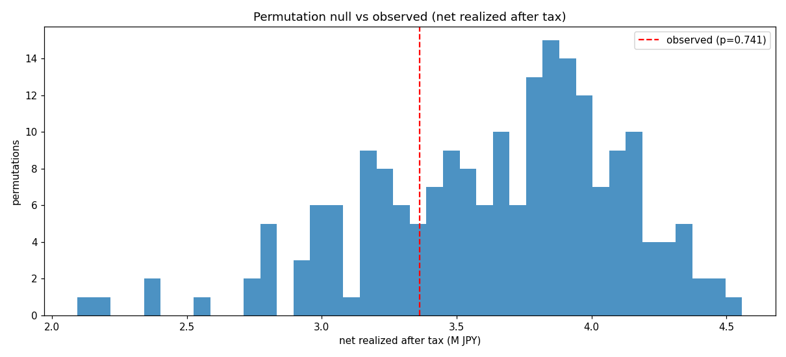

# 統計的検証レポート（第3週 / A）

> **目的**: 「ウォークフォワード＋ランダムサーチ」が生む**過剰最適化・多重比較バイアス**を疑い、本戦略の収益が
> **本物のタイミング・スキルか、それとも偶然（データスヌーピング）か**を統計的に検定する。
> **対象**: 1570.T 実データ 3,032営業日（2014-01-06〜2026-06-05・グリッチ補修済み）。
> **検定対象の戦略**: **デフォルト・パラメータの固定戦略**（後述の理由でウォークフォワード最適化器そのものではない）。
> **生成物**: `outputs_validation/`（`validation.json`・`permutation_null.png`）。再現: `python -m nikkei_leverage_sim.cli validate --config examples/config_fast.yaml --target data/target_1570_T.csv --benchmark data/benchmark_N225.csv --out outputs_validation`
>
> **コア結論（厳しめ・正直）**:
> **固定戦略のタイミング・エッジは統計的に検出できない。** 置換検定 **p=0.741**（実現益はタイミングを壊した帰無分布の
> 約74%に負ける）。年率リターンの 95%CI は **[0.05%, 0.50%]** とほぼゼロ。利確しきい値を5通り振っても **FDR で 0/5 が有意**。
> → 本戦略の小さな黒字は「押し目買いの妙」ではなく、**薄く建てた口座が市場ドリフト（β）を拾っているだけ**の可能性が高い。
> これはロードマップが警告した「多重比較で偽陽性を選んでいないか」という懸念の**定量的な裏付け**である。

---

## 0. なぜ「固定戦略」を検定するのか（検定設計の正当性）

置換検定・ブートストラップは戦略を多数回（数百回）再実行する。ウォークフォワード再最適化を毎回回すのは計算上非現実的
（200回×2.5分＝約8時間）。さらに**「実データで最適化したパラメータ」を観測値に使うと、観測値だけが系列にチューニング
され帰無側はされない**ため、検定が有意方向に偏る（まさに暴きたいデータスヌーピングを自分で混入させる）。
したがって**系列に未チューニングのデフォルト・パラメータ（戦略の事前ルール）を観測・帰無の双方で同一に用いる**のが
公平かつ不偏。これは「この事前ルールにタイミング・エッジがあるか」を問う検定であり、最適化器の検定ではない（限界として明記）。

---

## 1. 置換検定（タイミング・スキルの有意性）

ペア（1570.T・N225）の日次バーを**同一のランダム順序で並べ替え**（両者の連動は保ちつつ時系列の順序・自己相関を破壊）、
価格を再構成して固定戦略を再実行。これを 200 回。観測値が帰無分布の右裾にあれば「タイミングが効いている」。

| 指標 | 値 |
|---|--:|
| 観測（実現益・税後、デフォルト固定戦略） | ¥3.36M |
| 帰無平均 | ¥3.64M |
| 帰無 p95 | ¥4.31M |
| **p値（片側）** | **0.741** |

> **観測値は帰無平均を下回る**（¥3.36M < ¥3.64M）。すなわち「時系列の順序をランダムに壊した方が（平均的には）むしろ稼ぐ」。
> p=0.741 は、**この戦略のタイミング（押し目買い・利確）が偶然と区別できない**ことを意味する。
> 順序を壊しても稼げるのは、戦略が**ドリフト（上昇トレンド）を拾う**設計だから——それはスキルではなくβ。

---

## 2. ブートストラップ信頼区間（点推定を裸で出さない）

固定戦略の日次エクイティ・リターンを**ブロック・ブートストラップ**（ブロック長20）で 500 回再標本化し、年率リターンの分布を得る。

| 指標 | 値 |
|---|--:|
| 年率リターン 点推定 | 0.28% |
| **95%信頼区間** | **[0.05%, 0.50%]** |

> 区間はかろうじて正だが**実質ゼロ近傍**。手数料・スリッページの上振れ（Week2 §2）や前提のわずかな悪化で容易に
> ゼロ割れしうる水準。「儲かっている」と胸を張れる統計的余裕は無い。

---

## 3. 時系列セグメント別の一貫性（※クロスバリデーションではない）

固定戦略のエクイティ曲線を 5 つの連続セグメント（時代）に等分し、各セグメントの年率リターンを算出。
**これは「一発屋でないか」の一貫性チェックであり、学習/検証に分ける CV ではない**（固定戦略なので学習段階が無く、
エンバーゴは当指標に無関係）。真の最適化器 CV 用には、別途エンバーゴ付き分割器
`validation.purged_kfold_indices` を用意（テスト済み・将来の再最適化検証向け）。

| セグメント | 1 | 2 | 3 | 4 | 5 | 平均 | 標準偏差 |
|---|--:|--:|--:|--:|--:|--:|--:|
| 年率リターン | −0.26% | +0.66% | +0.37% | +0.35% | +0.24% | **+0.27%** | 0.30% |

> リターンは**特定の時代に偏らず**おおむね小幅プラスで一貫（セグメント1のみ僅かにマイナス）。
> 「一発屋」ではない点は安心材料だが、**水準が小さすぎて一貫性が報われない**。

---

## 4. 多重比較補正（Benjamini-Hochberg FDR）

利確しきい値 `base_take_profit_pct` を 5 通り（0.004〜0.015）試し、各々に置換検定の p値を求め、FDR=0.10 で補正。

| base_take_profit_pct | 実現益 | p値 | FDR で有意？ |
|---|--:|--:|:--:|
| 0.004 | ¥3.29M | 0.743 | ✗ |
| 0.006（既定） | ¥3.36M | 0.743 | ✗ |
| 0.008 | ¥3.45M | 0.743 | ✗ |
| 0.010 | ¥3.54M | 0.713 | ✗ |
| 0.015 | ¥3.67M | 0.762 | ✗ |

> **試した5通りのいずれも有意でない（0/5、補正後しきい値 0.0）**。複数の設定から「一番儲かった」を選んでも、
> それは多重比較の産物にすぎない。**少なくともこの利確しきい値グリッド上では、チューニングで有意なエッジは生まれない**
> （全パラメータ空間の網羅的探索を否定するものではないが、最も効きそうな軸で否定的）。

---

## 5. 限界（正直な但し書き）

- **検定対象は固定（デフォルト）戦略**。ウォークフォワード最適化器そのものの有意性は別問題で、本検定は答えない
  （§0 参照）。最適化器の優位は「再最適化込みの置換検定」が必要で、計算上は本レポートの範囲外。
- **置換は i.i.d. 並べ替え**で自己相関・ボラティリティ・クラスタリングを破壊する。ブロック置換にすれば帰無はより
  保守的になりうるが、本検定の問い（「順序＝タイミングに意味があるか」）には i.i.d. 並べ替えが適切。
- **観測は単一の歴史**。Week2 のブートストラップ（別シナリオ）と併読のこと。
- リターン水準が極小（年率0.3%弱）なのは**自己資金¥100Mに対し建玉が薄い**ため。レバレッジを上げれば名目リターンは
  伸びるが、Week2 が示すとおりテール（追証・破綻）も比例して増える。**「有意なエッジが無い戦略のレバレッジは増幅された
  βギャンブル」**になりうる点に留意。

## 6. テスト・再現

- `tests/test_validation.py`（11件）：パージK-foldの分割・エンバーゴ除外・BH既知ケース・置換検定の決定性とp値下限・
  **p値の片側裾方向**・ブートストラップCIの順序と決定性。全 **94件パス**。
- 全数値は `outputs_validation/validation.json`（`meta.data_repairs` にグリッチ補修を記録）。seed=42 で決定論的。
