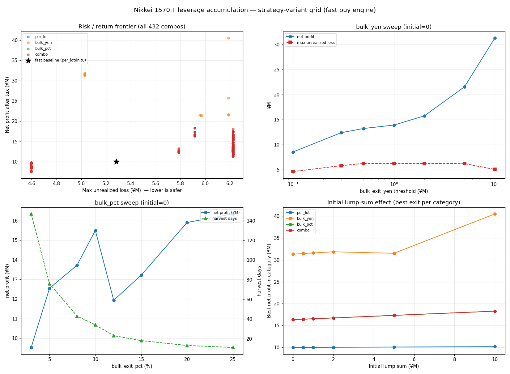

# 1570.T レバレッジ・ロング積み増し戦略 — 戦略バリアント・グリッドサーチ結果

> **対象データ**: 1570.T（日経2倍レバETF）実データ／ベンチマーク 日経225（N225）
> **期間**: 2014-01-06 〜 2026-06-05（**3,032営業日 ≒ 12年5ヶ月**）
> **買いエンジン**: 既存 **fast版（週次・apply_days=5）の walk-forward 選択パラメータを「そのまま再生」**（後述）
> **検証パターン数**: **432通り**（初期一括6 × 利確ルール{per-lot, bulk_yen 7, bulk_pct 8, combo 56}）
> **生成物**: `outputs_variants/`（`summary_all_variants.csv`・`top_per_category.md`・`variants_comparison.png`・エンジン別サブフォルダ）
> **コア改変なし**: 既存 `src/nikkei_leverage_sim/` には一切手を入れず、`variants/` に独立実装（並行タスクの強制決済モデルと衝突しない設計）

> 🔄 **v2 再生成ノート（2026-06）**: 本レポートは **v2 のデータ補修（2021-04-27/28 のベンダー偽半値を補正）後**に全 432 通りを再生成した数値です。補修前の旧版から **ベースライン純益は ¥10.48M → ¥9.99M（約 −4.7%）** に下方修正されました（幻の急落由来の利確が消えたため）。**最大含み損・最大DD は不変**（コロナ底由来でグリッチと無関係）。**核心の結論（bulk 利確＝含み損滞留を大幅圧縮、bulk_pct 3% が最も快適）は不変**ですが、**1 点だけ反転**しました：旧版で「bulk_pct 5% の Sharpe がベースを上回る」としていたのは、**偽の −50% 日がベースの Sharpe を不当に押し下げていた**ためで、補修後はベースの Sharpe が 0.376→**0.447** に上がり、**bulk_pct 5%（0.432）はベースをわずかに下回ります**（§1・§5C）。

---

## 0. ⚠️ 前提（REPORT_REAL の但し書きを継承）

本戦略は **「損切り禁止 ＋ 利確のみ」** の積み増し戦略です。`per-lot 利確`（既存）はこの構造上、エクイティ曲線は綺麗に右肩上がりに見える一方、**含み損の在庫が裏で滞留**します（fast版で全営業日の **76%が含み損**、最長 **534営業日（約2.1年）連続含み損**）。

本レポートのバリアントは、まさにこの「含み損の滞留」と「利確の気持ちよさ」を改善できるかを測るものです。**評価軸は実現益の総額ではなく、「気持ちよく・頻繁に・気分よく利確できるか（＝含み損に座る時間の短さ）」** に置いています。総額が最大の戦略 ≠ 最良の戦略、という原則も継承します。

---

## 1. エグゼクティブサマリ（先に結論）

**「気持ちよく利確」したいなら、`bulk_pct`（一括売却・固定%）の 3〜5% が答え。** per-lot 利確とほぼ同等のリターンを、**含み損を抱える日を 76%→43% に減らし、長期塩漬け（最長連続）を約1/5（534→102日）に縮めて**実現します。

| 観点 | 推奨 | 理由（vs fast版ベースライン ¥9.99M / 含み損76% / 最長534日 / Sharpe 0.447） |
|---|---|---|
| **気持ちよさ最優先**（リターンはベース同等でOK） | **`bulk_pct` 3%** | 純益 ¥9.52M（ベース比 −5%・ほぼ同額）／**含み損日 43%**（76%→大幅減）／**最長含み損 102日**（534日→約1/5）／1回利確が **¥65k**（¥22k の約3倍）／最大DDも ¥4.60M（5.26M→改善） |
| **バランス**（増益も欲しい） | **`bulk_pct` 5%** | 純益 **¥12.55M（+26%）** かつ含み損 50%・最長247日とベースより遥かに快適。ただし **Sharpe 0.432 はベース 0.447 に僅かに届かず**（補修でベースの Sharpe が上昇したため。§5C） |
| **総額最大**（快適さは二の次・トレンド乗り） | `bulk_yen` ¥500万〜¥1000万 | 純益 **¥21.5〜31.3M** だが **12年で利確3〜5回だけ**・最大DD ¥8.6〜10.2M・最長4年“利確なし”。これは「快適な利確」ではなく別物の **トレンド保有戦略** |

> **一言**: per-lot 利確は「**毎日チマチマ ¥22k 利確するが、裏で76%の日は含み損に座り、最長2.1年も塩漬け**」。`bulk_pct 3%` は「**月1ペースで ¥65k をまとめて気持ちよく利確し、含み損に座るのは43%の日・最長102営業日（約5ヶ月）**」。同じ金額なら後者が圧倒的に快適。

この結論は **買いエンジンを変えても崩れません**（§3 の二重エンジン検証で、per-lot の含み損74〜76%・約535日に対し、bulk_pct 3% は43%・55〜102日と両エンジンで一致）。

---

## 2. 主要パターン比較表（フロンティアを俯瞰）

代表的な11戦略（すべて初期一括なし＝`init0`、最終行のみA+B）。**comfort** は「利確体験の気持ちよさ」スコア（総額は含めず、利確頻度・1回の大きさ・含み損滞留で算出。高いほど快適）。

| 戦略 | 純益(税引後) | 年率 | 最大含み損 | 最大DD | 利確回数 | 1回平均 | 含み損日% | 最長含み損 | Sharpe | comfort |
|---|--:|--:|--:|--:|--:|--:|--:|--:|--:|--:|
| per-lot 利確（fast版ベースライン） | ¥9.99M | 0.79% | ¥5.28M | ¥5.26M | 454 | ¥22k | 76% | 534日 | 0.447 | −4.46 |
| **一括・3%（C）★気持ちよさ最良** | **¥9.52M** | 0.76% | **¥4.60M** | **¥4.60M** | 147 | ¥65k | **43%** | **102日** | 0.410 | **+0.12** |
| **一括・5%（C）★バランス最良** | **¥12.55M** | 0.99% | ¥6.22M | ¥6.42M | 76 | ¥165k | 50% | 247日 | 0.432 | −1.25 |
| 一括・8%（C） | ¥13.73M | 1.07% | ¥6.22M | ¥6.42M | 43 | ¥319k | 52% | 346日 | 0.420 | −1.83 |
| 一括・10%（C） | ¥15.50M | 1.20% | ¥6.22M | ¥6.42M | 34 | ¥456k | 50% | 346日 | 0.446 | −1.86 |
| 一括・¥10万（B） | ¥8.52M | 0.68% | ¥4.60M | ¥4.61M | 69 | ¥124k | 44% | 118日 | 0.359 | −0.41 |
| 一括・¥30万（B） | ¥12.37M | 0.97% | ¥5.79M | ¥5.95M | 39 | ¥317k | 45% | 346日 | 0.437 | −1.68 |
| 一括・¥100万（B） | ¥13.90M | 1.09% | ¥6.22M | ¥6.42M | 16 | ¥869k | 50% | 303日 | 0.384 | −1.82 |
| 一括・¥500万（B） | ¥21.54M | 1.63% | ¥6.19M | ¥8.58M | 5 | ¥4.31M | 50% | 328日 | 0.456 | −2.08 |
| 一括・¥1000万（B） | ¥31.30M | 2.29% | ¥5.03M | ¥10.21M | 3 | ¥8.63M | 39% | 328日 | 0.556 | −1.67 |
| 一括・¥1000万＋初期¥1000万（A+B） | ¥40.49M | 2.87% | ¥6.19M | ¥9.77M | 4 | ¥8.77M | 41% | 328日 | 0.653 | −1.64 |



**読み方**:
- **上に行くほど（しきい値↑）儲かるが、利確回数が激減し最大DDが深くなる**（含み益を長く抱える＝トレンド保有に近づく）。
- **下のしきい値（3%・¥10万）は儲けはベース並みだが、含み損に座る時間が劇的に短い**＝気持ちいい。
- per-lot は利確回数だけは圧勝（454回）だが、**1回 ¥22k の“塵”利確**で、かつ**含み損日76%・最長534日**という最悪の滞留プロファイル。comfort が突出して最下位（−4.46）。
- **Sharpe について（v2注）**: 補修でベース per-lot の Sharpe が 0.447 へ上がった結果、**低〜中しきい値の bulk（3〜10%）は Sharpe ではベースを上回りません**。bulk の価値は「Sharpe」ではなく **「含み損滞留の短さ＝快適さ」** にあります。Sharpe でベースを明確に超えるのは高しきい値のトレンド保有（¥500万 0.456／¥1000万 0.556／A+B 0.653）だけで、それらは快適さ最下位・DD 最深という別物です。

---

## 3. 方法論（なぜ速く・かつ現実的か）

### 3.1 買いエンジンは「fast版そのもの」を再生

fast版の唯一重い処理は、5日ごとに買いパラメータを再選択する **walk-forward 最適化（約3.5分）**。本グリッドでは:

1. その walk-forward を **一度だけ** 実行し、**各営業日に実際に選ばれた `StrategyParams` を丸ごと記録**（`wf_capture.py`、完全に因果的・既存fast版と同一）。
2. その**固定の日次パラメータ列を、軽量なバリアント・エンジンで全432通りに「再生」**（1通り約0.05秒）。

結果、**全432通りが「既存fast版とまったく同じ買い方」で積み増し**、変えたのは初期一括と利確ルールだけ — という**統制された比較**になります。
**検証**: この再生で `per-lot / init0` を回すと、既存fast版（v2・補修後）の公表値を **1円単位で再現**します（純益 ¥9,988,026／最大DD ¥5,256,961／最大含み損 ¥5,281,311）。これを自動テストで担保（`variants/tests/` が同一データ上でコア・エンジンとの一致を検証）。

### 3.2 二重エンジンによる頑健性検証

結論が「たまたまその買いパラメータの産物」でないことを確かめるため、グリッドを**2つの買いエンジン**で実行（`outputs_variants/walkforward/` と `outputs_variants/fixed_default/`）:

| | per-lot 含み損日% / 最長 | bulk_pct 3% 含み損日% / 最長 |
|---|---|---|
| walk-forward 再生（本命） | 76% / 534日 | 43% / 102日 |
| fixed default（保守的固定値） | 74% / 536日 | 43% / 55日 |

**両エンジンで一致** — 「bulk 利確は含み損滞留を大幅に圧縮する」という結論は買いパラメータに依らず頑健。

### 3.3 一括売却の会計（公平性）

bulk 系は**含み損ロットも含めて全建玉を一括売却**します（「完全リセット」）。税は**ネット（損益通算後）の正の益にのみ**課税（特定口座の同日一括決済に相当）。
— per-lot 戦略は損失を一切実現しない（通算する益がない）ので、この**ネット課税が両者を公平に**します。lot 単位の検証済み会計（`Portfolio`）をそのまま再利用し、現金・エクイティの整合は保持。

---

## 4. カテゴリ別ベスト（すべて `init0`＝初期一括なしの統制比較）

| カテゴリ | 総額最良 | 気持ちよさ(comfort)最良 |
|---|---|---|
| **per-lot（D・既存）** | `init¥1000万` ¥10.18M（初期一括の効果は誤差） | （全体最下位。頻度は高いが含み損76%・534日） |
| **bulk_yen（B）** | `¥1000万` ¥31.30M（利確3回／DD ¥10.21M） | `¥10万` comfort −0.41（含み損44%・最長118日） |
| **bulk_pct（C）** | `25%` ¥16.34M（利確11回） | **`3%` comfort +0.12（含み損43%・最長102日）← カテゴリ横断でも最良** |
| **combo（B+C）** | `¥200万+25%` ¥16.36M（利確12回） | `¥30万+3%` comfort +0.12（≒ bulk_pct 3%） |

詳細は [`outputs_variants/top_per_category.md`](outputs_variants/top_per_category.md)。

---

## 5. 各バリアントの所見

### A. 初期一括（Initial Lump Sum）— **ほぼ効果なし**
per-lot で初期一括を ¥0 → ¥1000万 と振っても純益は **¥9.99M → ¥10.18M** とほぼ不変。**最大グロス建玉 ¥1000万のキャップ**があるため、初期一括は「DCAが数週間で埋める枠を前倒しするだけ」で、12年スパンでは誤差。
初期一括が効くのは、**高しきい値の bulk_yen（トレンド保有）と組んだ時だけ**（大きな初期建玉を巨大トレンドで一括利確 → ¥40M）。ただし快適さの代償（DD ¥9.77M）。→ **「初期重め」は快適化の手段にはならない。**

### B. 一括売却・固定円（bulk_yen）
しきい値で性格が一変:
- **¥10万〜¥30万**: 含み損滞留を抑える快適ゾーン（含み損44〜45%・最長118〜346日）。¥10万は儲けがやや落ちる（¥8.52M）が、¥30万で ¥12.37M と増益。
- **¥100万〜**: 利確回数が16回以下に減り「待つ」戦略へ。
- **¥500万〜¥1000万**: 実質トレンド保有。¥21.5〜31.3M と大きいが**12年で利確3〜5回・最大DD ¥8.6〜10.2M・最長4年“利確なし”**。
> ※ bulk_yen は max_gross ¥1000万を超えて含み益が積み上がる（建玉は時価で値上がりするため）。¥1000万しきい値＝「ほぼ倍化するまで握って全部売る」。

### C. 一括売却・固定%（bulk_pct）— **本命**
当日高値が平均建値×(1+%) に達したら当日終値で全売却。
- **3%**: 純益ベース同等（¥9.52M・ベース比 −5%）で**最も快適**（含み損43%・最長102日・最大DD最小 ¥4.60M）。利確147回、1回 ¥65k。
- **5%**: **増益（+26%）かつ快適**（含み損50%・最長247日）。**ただし Sharpe 0.432 はベース 0.447 にわずかに届かない**。
  - **v2注（重要）**: 旧版では「5% の Sharpe 0.382 がベース 0.376 を上回る」としていたが、これは **2021-04 の偽 −50% 日がベース per-lot の Sharpe を不当に押し下げていた**ことの副産物だった。データ補修でベースの Sharpe が 0.447 に正常化した結果、**3〜10% の bulk_pct はいずれも Sharpe ではベースを上回らない**。bulk の利点は Sharpe ではなく**含み損滞留の短さ（快適さ）**にある、という本レポートの主旨はむしろ明確になった。
- **8〜25%**: しきい値を上げるほど増益（〜¥16.3M）だが含み損滞留が伸び、快適さは劣化。

### combo（B+C 併用）— **追加価値はほぼ無し**
小さい% を含む combo は **bulk_pct 単独とほぼ同一挙動**（% の方が先に発火）。comfort 最良の `combo ¥30万+3%`（+0.12）も bulk_pct 3%（+0.12）と**同一**。→ **複雑にする価値は乏しい。bulk_pct 単独で十分。**

### D. per-lot（既存）
利確頻度は最高（454回）だが、**1回 ¥22k の塵利確**かつ**含み損日76%・最長534日**。「綺麗に見えて、実は最も塩漬けに座り続ける」プロファイル。

---

## 6. なぜ bulk 利確は「気持ちいい」のか（メカニズム）

per-lot は**利益の出たロットだけ**を売り、含み損ロットは**永遠に持ち続ける**（損切り禁止）→ 含み損在庫が雪だるま式に滞留（76%の日・最長2.1年）。

bulk 利確は**含み益が出たタイミングで在庫を丸ごと一掃**する。これにより:
- **含み損を抱える日が大幅減**（76% → 43%）、**長期塩漬けがほぼ消滅**（534日 → 102日・約1/5）。
- 1回の利確が**まとまった金額**（¥22k → ¥65k）になり「**利確した感**」が出る。
- `bulk_pct 3%` の147回の一括売却は**大半が利益**。**含み益のタイミングで売るので損失決済はごく稀**で、稀に出ても小さい。

> per-lot の「決済勝率100%・損失ゼロ」は綺麗だが、それは**含み損を実現しないだけ**（裏に塩漬け）。bulk は時々小さな損を正直に実現する代わりに、**塩漬けを溜めない**。これが快適さの正体。

---

## 7. 推奨

1. **第一推奨 — `bulk_pct` 3%**: 「気持ちよく利確」の最適解。fast版とほぼ同じ金額（−5%）で、含み損に座る時間・最長塩漬け・最大DDのすべてを改善し、月1ペースで ¥65k をまとめて利確。
2. **増益も両立 — `bulk_pct` 5%**: +26%増益かつベースより快適（含み損滞留が短い）。**Sharpe はベースに僅差で届かない**ので「快適さ＋増益」を取りに行く選択。「もう少し攻めたい」人向け。
3. **代替 — `bulk_yen` ¥10万〜¥30万**: 円建てで管理したい場合の同等選択肢（快適ゾーン）。
4. **非推奨（“快適さ”目的では） — 高しきい値 bulk / 初期一括重め**: ¥21〜40M と儲かるが、**利確数回・DD ¥10M・最長4年利確なし**のトレンド保有。狙いが「快適な利確」なら別物。
5. **combo は不要**: bulk_pct 単独に対する追加価値が乏しい。

---

## 8. リスク・注意点（正直な但し書き）

- **bulk は損失を実現する**: per-lot と違い、一括売却時に含み損ロットも処分するため、**稀に小さな実現損**が出る。「決済勝率100%」の綺麗さは失うが、それと引き換えに塩漬けを溜めない。
- **高しきい値＝トレンド依存**: ¥500万〜¥1000万 bulk_yen の高リターンは「**この12年に致命的な非回復暴落が無かった**」ことに依存。指数が長期回復しない局面では、握り続ける分だけ per-lot 以上に痛む可能性。補修後はこれら高しきい値の最長含み損が 328日 まで伸びた（偽の急落が滞留を途中で“リセット”していた分が消えたため）。
- **bulk_pct の当日終値執行**: 「当日高値で発火→当日終値で全売却」を採用（仕様通り）。高値で目標到達後に終値が押し戻すと、想定より浅い利確（稀に小損）になる。
- **税のネット通算**: 一括売却の税は損益通算後の正益にのみ課税（特定口座相当）と仮定。実口座の通算ルール差で微差が出うる。
- **イン・サンプル比較**: 買いエンジンは fast版の walk-forward 選択を再生（因果的）だが、利確しきい値自体は全期間で固定。**しきい値の将来最適性は保証しない**（3%・5% は頑健だが過信しない）。
- **追証**: 全432通りで margin_call = 0（max_gross ¥1000万・自己資金 ¥1億の薄い建玉のため）。
- **データ補修**: 2021-04-27/28 のベンダー偽半値を補正済み（既定 ON）。補修は本レポートの全数値に反映済み。

---

## 9. 再現方法

```bash
cd nikkei_leverage_sim
# data/target_1570_T.csv, data/benchmark_N225.csv を配置（.gitignore 対象）
# 文字コードは .claude/settings.json の PYTHONUTF8=1 で対応済み（前置き不要）
PYTHONPATH="src;." python -m variants.run_all --out outputs_variants --refresh --processes 8
PYTHONPATH="src;." python -m variants.analyze   # outputs_variants/analysis.json を再生成
# テスト（コア＋バリアント7件は緑）
PYTHONPATH="src;." python -m pytest variants/tests -q
python -m pytest -q   # 既存コアのテスト（無改変）
```

設計詳細は [`variants/README.md`](variants/README.md)。全432通りの生データは
[`outputs_variants/summary_all_variants.csv`](outputs_variants/summary_all_variants.csv)。

---

*このレポートは既存コア（`src/nikkei_leverage_sim/`）を一切改変せず、`variants/` の独立実装で生成しています（並行実装中の強制決済モデルと非衝突）。数値は v2 データ補修後の再生成値（2026-06）。*
