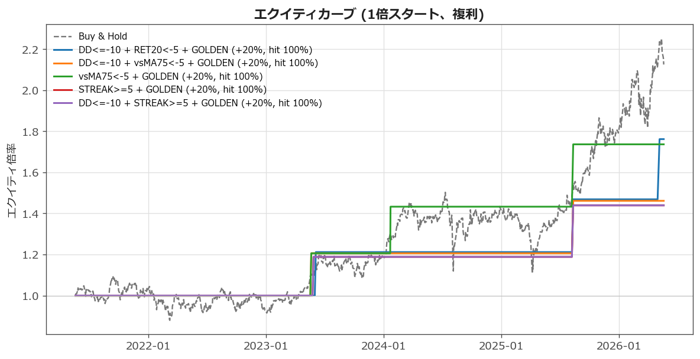
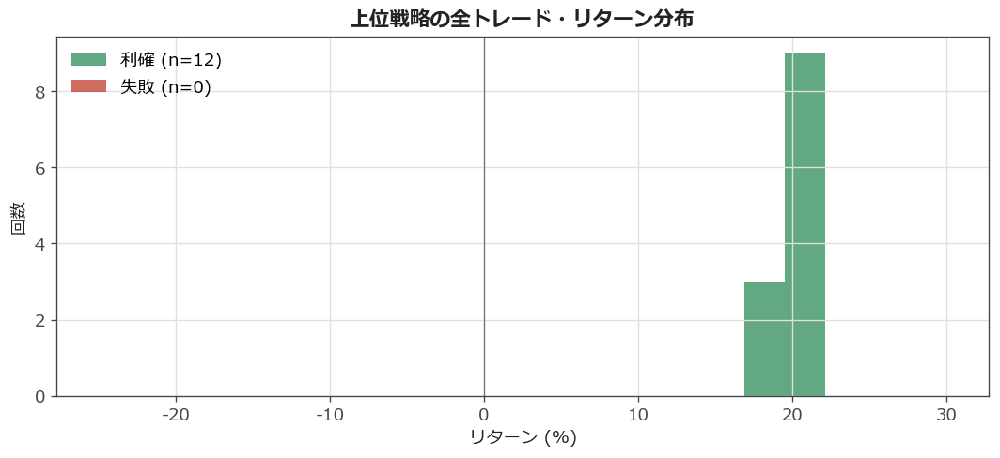
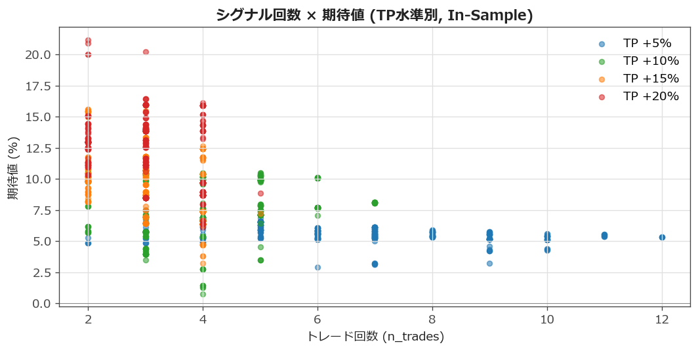
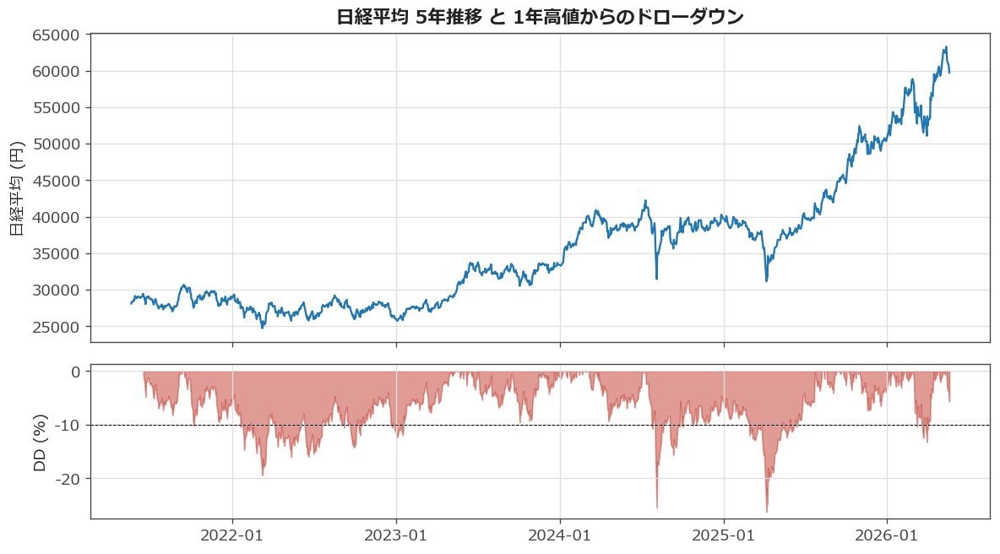

# 📊 日経225 シグナル・バックテスト レポート

> **生成日時**: 2026-05-20 06:26 UTC
> **データ**: yfinance `^N225` 日足 5年 (2021-05-20 – 2026-05-20, 1222本)
> **OOS分割**: 直近約252営業日 (`2025-05-08`以降) を Out-of-Sample に切り出し、残りを In-Sample
> **シグナル探索**: 20条件から単一 + 2-way + 3-way AND = **1,350通り**、5年で発生≥20回のみ集計
> **利確水準**: +5% / +10% / +15% / +20%、最大保有 **250営業日** で強制決済

## ⚠️ 重要な但し書き（必ず読む）

- 5年バックテストは **特定相場レジームに偏ります**。下の Buy&Hold が +112%/年率+16% なのが象徴で、直近の上昇トレンドが「どんなシグナルでも勝てて見える」状況を作っています。
- 1,350通りの多重比較で **偽陽性が出やすい** 構造です。In-Sample 期待値が高くても、OOS 列が空 or 大きく下がる戦略は過剰適合の疑い。
- **手数料・税・配当・スリッページは未考慮の理論値です**（指数そのまま）。
- 過去のパフォーマンスは将来を保証しません。

## ① 結論

In-Sample で期待値が最も高かったシグナル組み合わせ（OOS = 直近1年の同戦略再現）:

| TP | ベストシグナル | 到達率 | 回数 | 期待値 | OOS到達率 |
| ---: | :--- | ---: | ---: | ---: | ---: |
| **+5%** | `52W<20 + DD<=-10 + vsMA75<-5` | 100.0% | 3 | +7.50% | — |
| **+10%** | `DD<=-10 + STREAK>=10 + STREAK>=20` | 100.0% | 3 | +10.68% | — |
| **+15%** | `DD<=-10 + STREAK>=5 + GOLDEN` | 100.0% | 2 | +15.56% | — |
| **+20%** | `DD<=-10 + RET20<-5 + GOLDEN` | 100.0% | 2 | +21.19% | 100.0% (1回) |

ほとんどの戦略は **n=3〜10 程度の小サンプル** で、統計的信頼性は弱め。
**OOS列が「—」または激減している戦略 = 過剰適合の疑い** として扱ってください。

## ② ベンチマーク

### Buy & Hold (5年)

**+112.5%** (年率 +16.3%)

### ランダム1日エントリー（全1220日を対象に、翌日寄付エントリー → TP到達か250日経過まで）

| TP | 到達率 | 平均到達 | 平均リターン | n |
| ---: | ---: | ---: | ---: | ---: |
| +5% | **91.2%** | 50日 | +4.29% | 1220 |
| +10% | **76.2%** | 84日 | +6.90% | 1220 |
| +15% | **67.8%** | 111日 | +9.74% | 1220 |
| +20% | **58.7%** | 125日 | +12.52% | 1220 |

→ **「直近5年は、ランダムにいつ買っても20%上昇する確率が約60%」**。
シグナルがこの基準を有意に上回るかが、各戦略を評価する目線。

## ③ ランキング (期待値順 上位30件)

| シグナル | TP | 回数 | 到達率 | 平均日数 | 勝平均 | 失敗平均 | MFE | MAE | 期待値 | OOS到達 | OOS回数 |
| :--- | ---: | ---: | ---: | ---: | ---: | ---: | ---: | ---: | ---: | ---: | ---: |
| `DD<=-10 + RET20<-5 + GOLDEN` | +20% | 2 | 100% | 208日 | +21.2% | +0.0% | +21.6% | -8.1% | **+21.19%** | 100% | 1 |
| `DD<=-10 + vsMA75<-5 + GOLDEN` | +20% | 2 | 100% | 201日 | +20.9% | +0.0% | +21.3% | -6.6% | **+20.89%** | — | 0 |
| `vsMA75<-5 + GOLDEN` | +20% | 3 | 100% | 158日 | +20.2% | +0.0% | +21.0% | -4.6% | **+20.20%** | — | 0 |
| `STREAK>=5 + GOLDEN` | +20% | 2 | 100% | 202日 | +20.0% | +0.0% | +21.0% | -7.6% | **+19.98%** | — | 0 |
| `DD<=-10 + STREAK>=5 + GOLDEN` | +20% | 2 | 100% | 202日 | +20.0% | +0.0% | +21.0% | -7.6% | **+19.98%** | — | 0 |
| `52W<30 + DD<=-15 + vsMA75<-5` | +20% | 3 | 67% | 36日 | +20.8% | +7.7% | +17.8% | -4.3% | **+16.44%** | — | 0 |
| `52W<30 + DD<=-15` | +20% | 3 | 67% | 36日 | +20.8% | +7.7% | +17.8% | -4.3% | **+16.44%** | — | 0 |
| `52W<30 + DD<=-10 + DD<=-15` | +20% | 3 | 67% | 36日 | +20.8% | +7.7% | +17.8% | -4.3% | **+16.44%** | — | 0 |
| `RSI<40 + 52W<30 + RET5<-3` | +20% | 4 | 75% | 80日 | +20.9% | +1.6% | +18.9% | -5.1% | **+16.10%** | — | 0 |
| `RSI<40 + DD<=-15 + RET5<-3` | +20% | 3 | 67% | 120日 | +20.0% | +7.7% | +17.4% | -6.9% | **+15.93%** | — | 0 |
| `BB<20 + DD<=-15` | +20% | 3 | 67% | 120日 | +20.0% | +7.7% | +17.4% | -6.9% | **+15.93%** | — | 0 |
| `BB<20 + DD<=-10 + DD<=-15` | +20% | 3 | 67% | 120日 | +20.0% | +7.7% | +17.4% | -6.9% | **+15.93%** | — | 0 |
| `RSI<40 + DD<=-15 + vsMA75<-5` | +20% | 3 | 67% | 120日 | +20.0% | +7.7% | +17.4% | -6.9% | **+15.93%** | — | 0 |
| `RSI<40 + BB<20 + DD<=-15` | +20% | 3 | 67% | 120日 | +20.0% | +7.7% | +17.4% | -6.9% | **+15.93%** | — | 0 |
| `RSI<40 + DD<=-15` | +20% | 3 | 67% | 120日 | +20.0% | +7.7% | +17.4% | -6.9% | **+15.93%** | — | 0 |
| `DD<=-10 + DD<=-15 + vsMA75<-5` | +20% | 3 | 67% | 120日 | +20.0% | +7.7% | +17.4% | -6.9% | **+15.93%** | — | 0 |
| `DD<=-10 + DD<=-15 + RET5<-3` | +20% | 3 | 67% | 120日 | +20.0% | +7.7% | +17.4% | -6.9% | **+15.93%** | — | 0 |
| `RSI<40 + DD<=-10 + DD<=-15` | +20% | 3 | 67% | 120日 | +20.0% | +7.7% | +17.4% | -6.9% | **+15.93%** | — | 0 |
| `DD<=-15` | +20% | 3 | 67% | 120日 | +20.0% | +7.7% | +17.4% | -6.9% | **+15.93%** | — | 0 |
| `DD<=-15 + vsMA75<-5` | +20% | 3 | 67% | 120日 | +20.0% | +7.7% | +17.4% | -6.9% | **+15.93%** | — | 0 |
| `DD<=-10 + DD<=-15` | +20% | 3 | 67% | 120日 | +20.0% | +7.7% | +17.4% | -6.9% | **+15.93%** | — | 0 |
| `DD<=-15 + RET5<-3` | +20% | 3 | 67% | 120日 | +20.0% | +7.7% | +17.4% | -6.9% | **+15.93%** | — | 0 |
| `BB<20 + DD<=-15 + RET5<-3` | +20% | 3 | 67% | 120日 | +20.0% | +7.7% | +17.4% | -6.9% | **+15.93%** | — | 0 |
| `52W<30 + DD<=-15 + RET20<-5` | +20% | 3 | 67% | 36日 | +20.8% | +6.2% | +18.7% | -3.6% | **+15.93%** | — | 0 |
| `RSI<35 + BB<10 + 52W<30` | +20% | 4 | 75% | 80日 | +20.9% | +0.9% | +18.5% | -5.4% | **+15.91%** | — | 0 |
| `RSI<35 + RSI<40 + 52W<30` | +20% | 4 | 75% | 80日 | +20.9% | +0.9% | +18.5% | -5.4% | **+15.91%** | — | 0 |
| `RSI<40 + 52W<30 + RET20<-5` | +20% | 4 | 75% | 80日 | +20.9% | +0.9% | +18.5% | -5.4% | **+15.91%** | — | 0 |
| `RSI<35 + 52W<30 + RET5<-3` | +20% | 4 | 75% | 80日 | +20.9% | +0.9% | +18.5% | -5.4% | **+15.91%** | — | 0 |
| `RSI<35 + 52W<30` | +20% | 4 | 75% | 80日 | +20.9% | +0.9% | +18.5% | -5.4% | **+15.91%** | — | 0 |
| `RSI<35 + 52W<30 + RET20<-5` | +20% | 4 | 75% | 80日 | +20.9% | +0.9% | +18.5% | -5.4% | **+15.91%** | — | 0 |

## ④ トップ5戦略の詳細

### 1. `DD<=-10 + RET20<-5 + GOLDEN` × TP +20%

- トレード回数: **2回** (5年で発生 39回検出)
- 利確到達率: **100.0%**
- 平均到達日数: **208営業日** （≒ 9.9ヶ月）
- 勝ち平均リターン: **+21.19%**
- 失敗時平均リターン: **+0.00%** (中央値 +0.00%)
- 平均MFE (含み益MAX): +21.59%
- 平均MAE (含み損MAX): -8.13%
- **期待値: +21.19%**
- OOS検証: 直近1年で発生 **1回**、到達率 **100.0%**、期待値 **+19.96%**
### 2. `DD<=-10 + vsMA75<-5 + GOLDEN` × TP +20%

- トレード回数: **2回** (5年で発生 23回検出)
- 利確到達率: **100.0%**
- 平均到達日数: **201営業日** （≒ 9.6ヶ月）
- 勝ち平均リターン: **+20.89%**
- 失敗時平均リターン: **+0.00%** (中央値 +0.00%)
- 平均MFE (含み益MAX): +21.29%
- 平均MAE (含み損MAX): -6.63%
- **期待値: +20.89%**
- OOS検証: **直近1年では発生なし**（OOS検証不能）
### 3. `vsMA75<-5 + GOLDEN` × TP +20%

- トレード回数: **3回** (5年で発生 25回検出)
- 利確到達率: **100.0%**
- 平均到達日数: **158営業日** （≒ 7.5ヶ月）
- 勝ち平均リターン: **+20.20%**
- 失敗時平均リターン: **+0.00%** (中央値 +0.00%)
- 平均MFE (含み益MAX): +20.97%
- 平均MAE (含み損MAX): -4.63%
- **期待値: +20.20%**
- OOS検証: **直近1年では発生なし**（OOS検証不能）
### 4. `STREAK>=5 + GOLDEN` × TP +20%

- トレード回数: **2回** (5年で発生 32回検出)
- 利確到達率: **100.0%**
- 平均到達日数: **202営業日** （≒ 9.6ヶ月）
- 勝ち平均リターン: **+19.98%**
- 失敗時平均リターン: **+0.00%** (中央値 +0.00%)
- 平均MFE (含み益MAX): +21.00%
- 平均MAE (含み損MAX): -7.60%
- **期待値: +19.98%**
- OOS検証: **直近1年では発生なし**（OOS検証不能）
### 5. `DD<=-10 + STREAK>=5 + GOLDEN` × TP +20%

- トレード回数: **2回** (5年で発生 32回検出)
- 利確到達率: **100.0%**
- 平均到達日数: **202営業日** （≒ 9.6ヶ月）
- 勝ち平均リターン: **+19.98%**
- 失敗時平均リターン: **+0.00%** (中央値 +0.00%)
- 平均MFE (含み益MAX): +21.00%
- 平均MAE (含み損MAX): -7.60%
- **期待値: +19.98%**
- OOS検証: **直近1年では発生なし**（OOS検証不能）

## ⑤ エクイティカーブ

上位5戦略 + Buy&Hold（破線）。横ばい区間は「ポジションを持っていない時間」。

## ⑥ トレード・リターン分布

上位5戦略の全トレードを「利確（緑）」「失敗（赤）」で重ね書き。

## ⑦ シグナル回数 × 期待値（全候補）

右下の点群 = 「回数は稼げるが期待値マイナス」（ただ買ってるだけ）。
左上に外れている点ほど価値あるシグナル候補（ただし n が小さい点は要警戒）。

## ⑧ 相場コンテキスト

5年の日経推移と1年高値からのドローダウン（10%ラインを破線で表示）。
このバックテスト期間中、10%超のドローダウンに入った局面が **何回・どのくらいの深さだったか** がここから読めます。

## ⑨ メソッドの詳細

- **エントリー**: シグナル発生日の翌日<em>始値</em>で約定（ルックアヘッド回避）
- **エグジット**: 当日<em>高値</em>が利確水準にタッチした日の<em>終値</em>で利確（保守的：タッチしただけ約定にはしない）
- **最大保有**: 250営業日 (≒1年) で強制決済し失敗扱い
- **ポジション**: 1ポジション運用、保有中の新シグナルは無視
- **シグナル定義**: 20条件 (RSI / BB位置 / 52週位置 / DD率 / 連続DD日数 / リターン / MA乖離 / ゴールデンクロス) から単一/2-way/3-way ANDで網羅
- **MFE/MAE**: 各トレードの保有中最大含み益 / 最大含み損（%、トレード平均）
- **Out-of-Sample**: 全期間の末尾約252営業日を IS から除外し、IS でランキング決定 → 同じ戦略を OOS 区間で再評価
- **データ**: yfinance `^N225`、`auto_adjust=False`（指数値そのまま）

## ⑩ 注意点と限界

1. **5年は短い**。コロナ底（2020/3）や 2018年末暴落のような異常局面が含まれていない。10年〜20年に拡張すると印象が変わる可能性が高い。
2. **直近トレンドのバイアス**。Buy&Hold で +112%/5年 = ほぼ全シグナルが「勝てて見える」状況。逆相場（横ばい〜下落）でも同じ結果になる保証はない。
3. **n が小さい**。トップ戦略の多くは n=3〜10。20%の利確水準で十分にトリガーするには、より長期データが必要。
4. **生存者バイアスを完全には排せない**。ここで上位に来たシグナルが「過去5年の偶然」かもしれない、という前提でOOS列を読む。
5. **指数 vs ETF**。実トレードでは `1321` (野村日経225ETF) などになるため、配当・スプレッド・板の薄さで若干パフォーマンスが下がる。

## ファイル一覧

- 本ファイル: `signal_report/REPORT.md`
- 生CSV: `signal_report/data/results.csv` (全1240行、IS集計のフル)
- JSONサマリ: `signal_report/data/summary.json`
- 図: `signal_report/figures/*.png`
- ローカル閲覧用HTML（Plotly対話チャート版）: `signal_report/report.html`
- 公開ホスティングの選択肢: `signal_report/OPTIONAL_HOSTING.md`

---

*このレポートは `signal_report/backtest.py` を実行すると再生成されます。*
